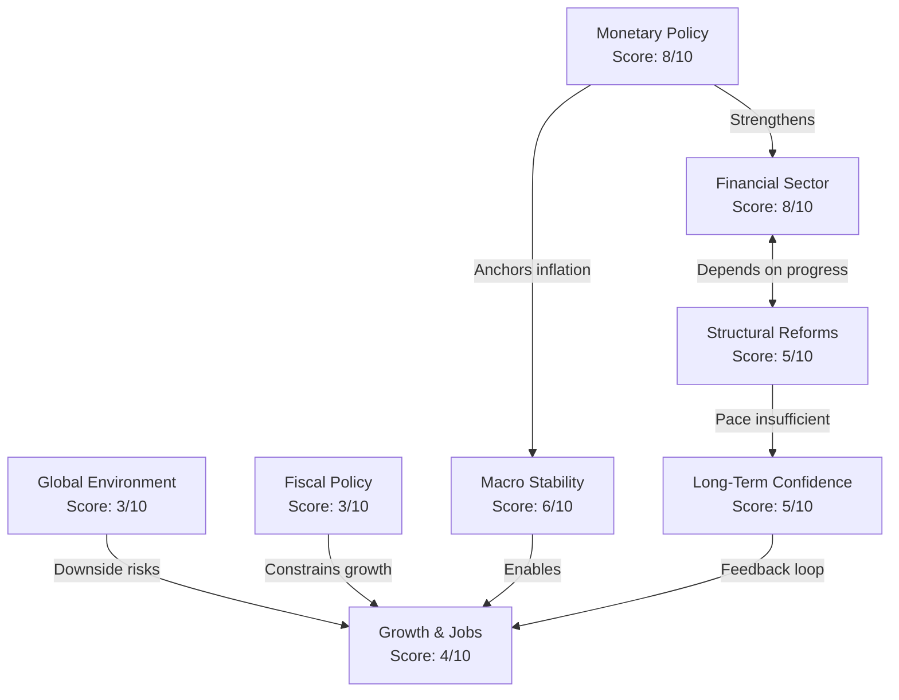

# Tellusant Publications
This repository contains various published materials by Tellusant team members. 
Its purpose is to:
- Serve as a consolidated hub of all publications  
- Give longevity beyond what social media offer  
- Allow for fast search engine / AI crawling and indexing  
- Create open access and bypass gated sites like LinkedIn and Medium

---

#### [Enter the repository](index.md)   

## License
[Creative Commons Attribution Sharealike International 4.0](https://creativecommons.org/licenses/by-sa/4.0/deed.en)
