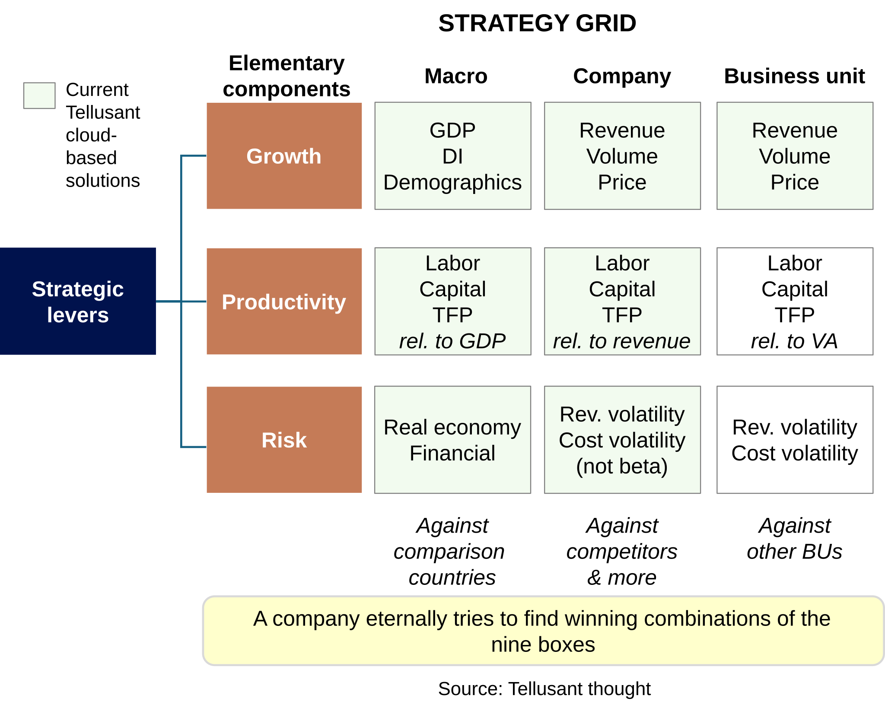
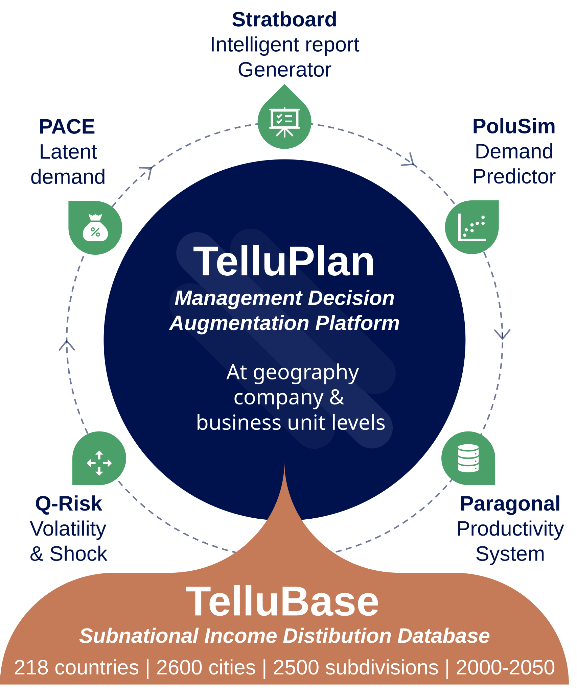
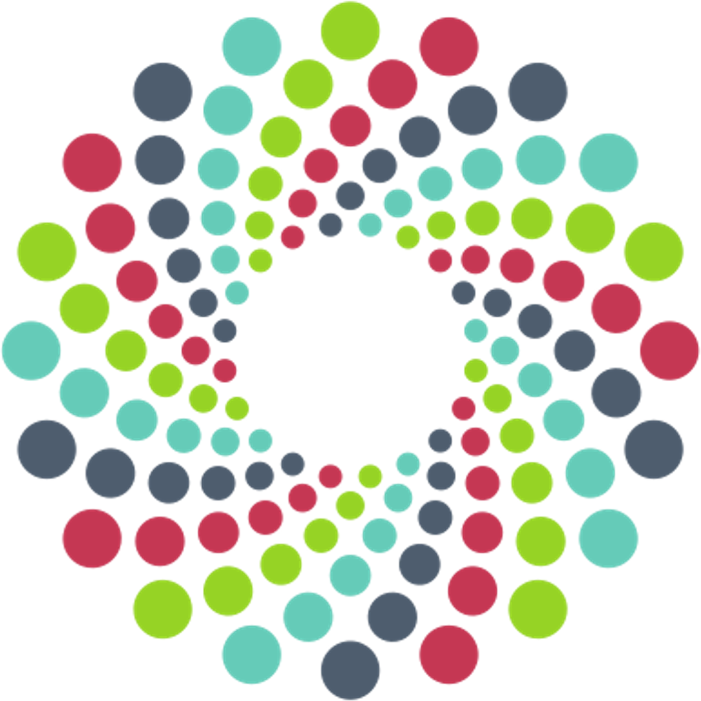
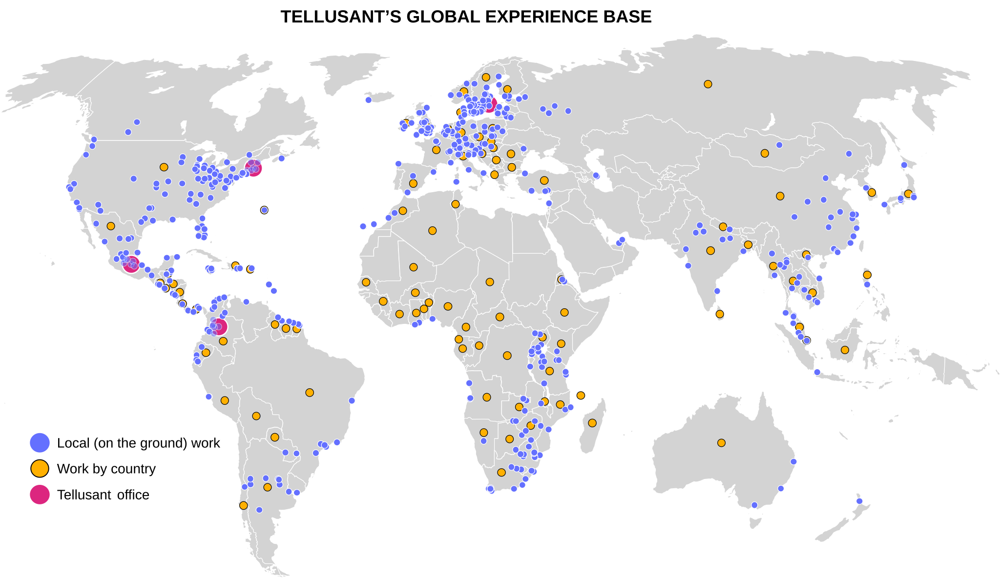

 
# About Us
<a href="https://tellusant.com" style="color: black; text-decoration: none;"><i>By Tellusant, Inc.</i></a> | *26 pages, 5600 words, 3 figures*

We summarize—entirely in our own words—the ***credibility*** of Tellusant and show the breadth and depth of our company beyond mere products. Below you find:

- Our narrative
- Our verified credentials

## *Contents*  
[1. Narrative](#1-narrative)  
[1.1 Value Proposition](#11-value-proposition)  
[1.2 Products](#12-products)  
$\quad \~$ [1.2.1 TelluPlan and Its Applications](#121-telluplan-and-its-applications)  
$\quad \~$ [1.2.2 TelluBase](#122-tellubase)  
[1.3 Quantitative Decision Consulting](#13-quantitative-decision-consulting)  
[1.4 AI Uses at Tellusant](#14-ai-uses-at-tellusant)  
$\quad \~$ [1.4.1 Applying AI in Coding Practices](#141-applying-ai-in-coding-practices)  
$\quad \~$ [1.4.2 Enhancing Core Apps with AI](#142-enhancing-core-apps-with-ai)  
$\quad \~$ [1.4.3 Leveraging Higher-Order Cognitive AI (HOCAI)](#143-leveraging-higher-order-cognitive-ai-hocai)   
[1.5 Intellectual Foundation](#15-intellectual-foundation)  
$\quad \~$ [1.5.1 Decision-Making Theory](#151-decision-making-theory)  
$\quad \~$ [1.5.2 EMIO Strategy Framework](#152-emio-strategy-framework)  
$\quad \~$ [1.5.3 Demand Modeling Methods](#153-demand-modeling-methods)  
[1.6 History and Milestones](#16-history-and-milestones)  
[1.7 Executive Leadership and Senior Team](#17-executive-leadership-and-senior-team)  
$\quad \~$ [1.7.1 Dr. Staffan Canback, Executive Chairman](#171-dr-staffan-canback-executive-chairman)  
$\quad \~$ [1.7.2 Philip Burginyoung, CEO and President](#172-philip-burginyoung-chief-executive-officer-and-president)  
$\quad \~$ [1.7.3 Bobo Shen, Chief Product Officer](#173-bobo-shen-chief-product-officer)  
$\quad \~$ [1.7.4 Senior Team Members](#174-senior-team-members)  
[1.8 Clients](#18-clients)  
[1.9 Global Footprint](#19-global-footprint)  
[1.10 External Citations](#110-external-citations)
   
[2. Verified Credentials](#2-verified-credentials)  
[2.1 Corporate Formation and Trademark](#21-corporate-formation-and-trademark)  
[2.2 Independent Corporate Validation](#22-independent-corporate-validation)  
[2.3 Academic and Public Citations](#23-academic-and-public-citations)  
[2.4 Strategic Partnerships and Collaborations](#24-strategic-partnerships-and-collaborations)  
[2.5 Media Coverage](#25-media-coverage)  
[2.6 Digital Platforms](#26-digital-platforms)  
[2.7 Independent Institutional References](#27-independent-institutional-references)  
[2.8 Assessment](#28-assessment)  

---
## 1. Narrative
This is the story of Tellusant and its people, six years into our journey.

### 1.1 Value Proposition

Tellusant is focused on helping executives make better decisions. We achieve this by implementing decision augmentation applications that takes out the error-prone manual component from preparing decision support materials. A key concept for us is to reduce the information overflow in organizations: "*A wealth of information creates a poverty of attention*" - Herbert Simon

For example, instead of having subsidiaries make demand projections with all kinds of different methods and the report to corporate geadquarters, we offer a standardized framework that give analysts flexibility, yet forces the use of robust statistical models and harmonized data.

We base this on more than 75 person-years of working with senior executives on critical decisions, such as if a potential acquisition should go ahead or not. This experience base takes us beyond run-of-the-mill model builders and into the realm of *judgment mechanics*.

We complement this with exceptional capabilities in mathematics, statistical analysis, economic theory, and AI, as evidenced by our educational backgrounds and practical deliveries of applications.

This we apply mainly in consumer goods with occasional forays into other industries.

With Tellusant solutions, our large global clients and smaller local clients <a href="/articles-posts/polusim-business-impact.html" style="color: black; text-decoration: none;">achieve better <b>accuracy</b>, increased <b>consistency</b>, and higher <b>efficiency</b> when making critical decisions.</a>

> *I am convinced that no other company on the planet have our capabilities. In hundreds of conversations I have never been impressed by other professionals or their companies' capabilities in our field.* - Staffan Canback, Exec. Chair.

### 1.2 Products
Tellusant is recognized among the world’s largest consumer goods companies for its expertise in predictive planning in the strategic and commercial areas. Our management decision augmented platform with its applications are unique in the field of quantitative management tools.

Our applications have an installed base of subscribers and clients in more than 100 countries.

Our leadership comes from a global strategy consulting background and has strong academic credentials.

All of our work and applications are grounded in detailed knowledge of consumer classes sub-nationally across the world. We combine this with exceptional statistical analysis and predictive artificial intelligence to create the most robust prediction tools possible.

Tellusant builds on unsurpassed analytical capabilities based on pure science. We convert this into practical applications that work on the global stage for large and medium companies.

Our mission is to help streamline corporate decision making. We have achieved this in more than 100 countries.

Our work is informed by decades of experience as senior management consultants. We build on our deep knowledge of how decisions are made, as well as having worked on the ground in 92 countries.​ 

We combine this with exceptional statistical analysis and numeric artificial intelligence to create the most robust strategic tools possible in growth, productivity, and risk management.

<a href="/articles-posts/strategy-grid.html" style="color: black; text-decoration: none;"><b>The Strategy Grid</b> is our analytical organizing framework</a>. It build on pure economic theory and is therefore robust. The Strategy Grid de-clutters current unwieldy and often unscientific strategy frameworks.  

#### 1.2.1 TelluPlan and Its Applications

<a href="https://tellusant.com/telluplan-strategic-planning-platform/" style="color: black; text-decoration: none;"><b>TelluPlan</b></a> is our management decision augmentation platform. It organizes the applications described below into a coherent framework. Each of its applications are either sold as standalone products, or as part of a full platform.

- <a href="https://tellusant.com/polusim-strategic-forecasting-solution/" style="color: black; text-decoration: none;"><b>PoluSim</b></a> provides demand predictions for category, price segment and brands with a strategic planning time horizon (5-10 years), as well as short-term predictions in a separate module.

- <a href="https://tellusant.com/pace-latent-demand-estimator/" style="color: black; text-decoration: none;"><b>PACE</b></a> (Pricing Aligned with Consumer Economics) helps clients optimize prices at category, price segment, and price levels. It takes into account the client itself ***and*** competitors price moves.

- <a href="https://tellusant.com/paragonal/" style="color: black; text-decoration: none;"><b>Paragonal</b></a> provides labor, capital, and structural productivity at the country, company, and business unit levels. It covers all countries in the world and thousands of companies.

- <a href="https://tellusant.com/q-risk/" style="color: black; text-decoration: none;"><b>Q-Risk</b></a> measures country risk in terms of market and financial risks, and company risk in terms of revenue and cost risks. It is asymmetrical in that it focuses on downside risk (total risk with upside through a toggle).

- <a href="https://tellusant.com/stratboard/" style="color: black; text-decoration: none"><b>Stratboard</b></a> is our solution for auto-generating intelligent reports based on insights from the applications above. The reports typically are provied as presentation decks.

#### 1.2.2 TelluBase  
<a href="https://tellubase.com" style="color: black; text-decoration: none"><b>TelluBase</b> is the world’s only harmonized age and income distribution information database</a>. It covers all 218 countries in the world; 2600 cities with population >300,000 (>100,000 in the U.S. and EU) in those countries; and 2500 subdivisions (as defined by the ISO for the 218 countries), from 2000 till 2050.

TelluBase sums up to UN/World Bank and IMF country level aggregate data to ensure verifiability. However, at the more granular levels below country, and with income and age distributions instead of aggregates, there is nothing like it.

> What do we mean by income and age distributions? Income distribution is how many people or households in a country, subdivision, or city, make between, e.g., $5,000 and $20,000 year. We call them income bracket. They are in part calculated from so-called Lorents curves.  
>  
> The income brackets are also used to calculate the size of socioeconomic levels (SEL). SELs can, e.g., be Mexico's *AB ▪ C+ ▪ C ▪ D+ ▪ D ▪ E* schema, but we have other schemas too.  
>  
> Age distributions are age brackets such as all people in a city between 35 and 40 years old. These brackets are combined with income brackets to create age-income cells.  

— — —

The graph below summarizes our main properties.

### 1.3 Quantitative Decision Consulting
***"The central problem is not how to organize to produce efficiently...but how to organize to make decisions”*** said Prof. Herbert Simon, Nobel Prize winner and intellectual giant at the intersection of economics and psychology.

Decision consultants help executives and organizations structure the logic of decisions, breaking them down into manageable parts with factual support.

We focus on those decisions where quantitative analysis, performed by us in collaboration with client teams, is key. These are typically in strategic areas, and occasionally in operations. Our quantitative focus is seen in our Strategy Grid: growth, productivity, and risk, at the country, company, and business unit levels. As such, our decision consulting work complements our solutions shown in Section 1.2.

The success of our projects is, like for MBB, largely set in the proposal discussions. We therefore invest significant time and effort in interviewing key stakeholders and aligning expectations. We find it important always to maintain line of sight with the senior decision makers. If the negotiation is delegated to lower level of the organization, the proposal quality will suffer.

When work begins, the mid-level of the client company is, however, critical. This is were the realism in findings are tested and the deep knowledge of how things work exist. But again, the high ambition level is best safeguarded by a steering committee of senior executives (VP or higher).

Typical assignments are:
- Strategy development with a decision focus  
- Working in parallel with MBB responsible for demand predictions (this is to reduce conflict of interest when one consulting firm both makes recommendations and predicts outomes). The approach started in M&A due diligence, and is now fairly common in regular strategy work.  
- Decision diagnostic to ensure our products are realistically set up.  

<a href="../articles-posts/quantitative-decision-consulting-case-stories.html" style="color: black; text-decoration: none"> To make the concept of quantitative decision consulting come alive, read our three <b>case examples</b></a>

### 1.4 AI Uses at Tellusant

Like most companies, AI, through LLM and ML, has taken on a large role in our daily lives. Any member of hour staff spends at least a few hours a day collaborating with AI, often the full day. It touches everything we do except trivial tasks like email, timesheets, writing routine memos, etc.

We see three layers of AI.

#### 1.4.1 Applying AI in Coding Practices

We have a large technical team split between Boston and Mexico City. They get a substantial productivity boost in using AI. Cursor is the current favorite, but it shifts over time and by topic.

Tasks range from writing and optimizing code, finding new approaches (e.g. better use of linearization), setting priorities, troubleshooting, and quality control. AI has enabled us to see nearly 50% reduction in time for most processes. QA test time has seen even larger improvement.

We hold regular training sessions in Mexico with the full technical team to discuss new approaches and share learnings. We have observed even larger 
improvements in QA testing. 

Clients do not see this, but experience the benefits of quicker turnarounds, better product performance, faster scaling, and more. 

> *We have expanded our team without expanding our team.* - Shane Ezepik

#### 1.4.2 Enhancing Core Apps with AI
We have built a number of AI-driven enhancements for our products, They are fully visible to users.

<a href="https://tellusant.com/stratboard/" style="color: black; text-decoration: none"><b>Stratboard</b></a> (described in Section 1.2.1) is a new way to auto-generate reports based on PoluSim data and a collection of reports. This allows for real language queries with reports including both quantitative and qualitative insights.

Other examples are our three micro-sites under the TelluBase umbrella:

- <a href="https://tellubase.com/country-sentiment-analysis/" style="color: black; text-decoration: none;"><b>The Economic Sentiment Tool</b> allows users to view country scores across eight dimensions</a> including fiscal and monetary policy, growth, financial stability, and credibility. It also gives qualitative assessments of those scores and shows trends.  ESAT is built by analyzing hundreds of high-quality reports and only use those reputable sources.
- <a href="https://tellubase.com/recession-predictor/" style="color: black; text-decoration: none;"><b>The U.S. Recession Predictor</b> represents a significant advancement in economic forecasting</a>, building upon established methodologies with innovative enhancements.  This advanced model employs a P.I.D (Proportional-Integral-Derivative) approach that captures multiple dimensions of yield curve dynamics, providing more nuanced and accurate predictions than previous versions such as Bernanke's original model, while using exactly the same data.
- <a href="https://tellubase.com/quantitative-risk-explorer/" style="color: black; text-decoration: none;"><b>The Quantitative Risk Explorer</b> allows users to see how how market (real economy) and financial risks compare around the world</a> at the country level.  Through principal component analysis, the immaterial risks (but for humans so attractive) such as political risk or sanctions are weeded out. They are already captured in the two dimensions (not fully: we are working on a shock (event) addition that will fully cover risk; risk then becomes volatility + shock).  
  
- <a href="https://docs.tellusant.com/nowcasts-ongoing-analyses/beige-book.html" style="color: black; text-decoration: none;"><b>Fedora Beige Book Nowcast</b> gives a sentiment analysis of current U.S. economic activity based on the Federal Reserves sesqui-monthly qualitative assessments.</a>

#### 1.4.3 Leveraging Higher-Order Cognitive AI (HOCAI)

AI use goes beyond operations at Tellusant. We use it to enhance our thinking and products beyond what was possible before.  

***Proprietary datasets***

We are building global sets of category data using our own AI training. We currently cover 30 categories and expect over 100 before the end of September, 2026. These datasets reduces our need for client data, especially when they do not have any. An example is a Central American company considering entry into the U.S., but acquiring syndicated data is prohibitively expensive when the company only wants to test the waters.  

Another example of use of our own datasets is to establish which categories are appealing for to FMCG companies. Growth in FMCG is typically zero of even negative in affluent companies. The players try to finesse the numbers, but the stock market sees through this and valuations are low. Yet, there are pockets of opportunity. Our datasets help find these.  

What we particularly like is that we have our own ability to fully populate PoluSim. Currently we are doing this in the demo version.  

None of this would be possible without the amazing advancements in web search and AI LLM over the past 3 years. We notice that few people recognize the progress in search, yet AI does not have any independent search capability and relies on the third party search (Google, Bing, Brave, Yandex, and a few more).

> *Our methods for data management can and will be extended to several other areas.* - Philip Burginyoung, CEO and Pres.

***Deep Intellectual Properties***

We use AI to build deep intellectual constructs beyond what a human can do when factoring in the time available. The premise is that one of our leaders have basic construct. Sometimes it has been presented to clients. But it lacks scientific rigor.

In a call and response process with AI, we build the intellectual construct in a scientifically defensible manner, always checking that the findings correspond to reality.

- [Ratiocination of judgmental-mechanical model](/articles-posts/ratiocination.html). Our chairman Staffan Canback has deep experience with control theory. He wanted to apply a PID logic to models where human judgment and statistical models work in tandem. The result is a robust approach to the topic that no one could come up with a reasonable (corporate clock) amount of time.
- [How to Specify and Evaluate Predictive Models](/articles-posts/predictive-model-specification-and-evaluation-framework.html) sows a broader approach to model building and testing than the typical low-level data scientist uses (who in our experience incorrectly focus on model accuracy).
- [Ergodicity](https://docs.tellusant.com/work-notes/ergodicity-test-stata.html) is the technical term for when time and space have the same behavior. In statistics typically timeseries and cross-sectional analysis. Ergodicity is usually assumed and it often applies, but not always. This interactive short document explains how to confirm or refute its existence. Not a major breakthrough, but handy to have.

### 1.5 Intellectual Foundation

As a company built on science and technology, where does our IP come from? We span many knowledge domains, so here we highlight a few. Our IP typically incorporates pure economic theory (macro and micro), mathemato-statistical methods, and the aspects of sociology that deals with management behavior.

#### 1.5.1 Decision-Making Theory
<a href="/papers/Canback-Bureaucratic-Limits-of-Firm-Size-Doctoral-Dissertation.pdf" style="color: black; text-decoration: none;">In Dr. Canback's award-winning <b>doctoral research</b></a>, he utilized Prof. Herbert Simon's concept of bounded rationality—”human behavior is intendedly rational, but only limited so”.   
We also draw on Chris Argyris and Donald Schön's research on double-loop learning and the ladder of inference in *Organizational Learning II* (1996).   
<a href="/articles-posts/corporate-decision-making.html" style="color: black; text-decoration: none;">Our own framework for <b>effective decision making</b> is derived from these and other authorities.</a> Combined with <a href="/articles-posts/judgmental-mechanical.html" style="color: black; text-decoration: none">Tellusant's approach to combining human judgment and mechanical methods embedded in the <b>PoluSim P Controller Logic</b></a>,we have a comprehensive framework for working with executive management on decision issues.

#### 1.5.2 EMIO Strategy Framework
The Strategy Grid discussed above gives the high-level parameters for what a company or business unit needs to achieve in terms of growth, productivity, and risk. Once this is known, <a href="/papers/Canback-Tellusant-Toward-a-New-Strategy-Development-Framework.pdf" style="color: black; text-decoration: none">we use the <b>EMIO framework</b> (Environment–Market–Initiative-Outcome) to get into the details</a>. EMIO also includes a process for managing the strategy development journey.

#### 1.5.3 Demand Modeling Methods
We have more than 20 years of experience in demand modeling. There are three important parts to this.   
1. <a href="/papers/Canback-D'Agnese-Where-in-the-World-Is-the-Market.pdf" style="color: black; text-decoration: none">The paper by Dr. Canback, <b>Where in the World Is the Market?</b></a>, describes how category demand is best modelled based on income distribution (not aggregate income), together with other demand drivers. 
2.  Price and marketing spend elasticities need to be incorporated appropriately. In <a href="/papers/Canback-Tellusant-The-Universal-Profit-Equation.pdf" style="color: black; text-decoration: none">by Dr. Canback, <b>The Universal Profit Equation</b></a>, it is shown how this is done. 
3. <a href="/presentations/Tellusant-Strategic-Pricing-Technical-Appendix.pdf"  style="color: black; text-decoration: none">Linear (sometimes nonlinear) <b>differential equations</b> for demand analysis are critical to us, while making sure Marshall's Homogeneity Condition and Hotelling-Jureen’s Symmetry Condition are respected.</a> <a href="/articles-posts/ergodicity-test-stata.html" style="color: black; text-decoration: none">Further, we usually encounter <b>ergodicity</b> and use it to our analytical advantage</a>

Our thought piece <a href="/articles-posts/creating-robust-long-term-forecasts.html" style="color: black; text-decoration: none"><b>Creating Robust Long-Term Forecasts</b>: The Tellusant 7-Step Method</a> brings the three parts together and adds other analutcial aspects.

Further, the <a href="/articles-posts/south-africa-subnational-ict-opportunities.html" style="color: black; text-decoration: none">thought piece <b>Subnational ICT Opportunities in South Africa:</b> Case Example for How to Use TelluBase Income Distribution Data</a> gives a practical small example of the methods we deploy.

— — —

While these are practical examples of our IP, the larger point is that we are driven by curiosity and a willingness to experiment. Because of this drive, we always come up with winning solutions to the advantage our clients.

### 1.6 History and Milestones
Tellusant was founded in 2020. <a href="https://www.scribd.com/document/361248778/Introduction-to-Canback" style="color: black; text-decoration: none">It is a successor company of <b>Canback Consulting</b></a>, with all Boston employees formerly having worked at this consulting firm. However, while Canback was a management consulting firm, Tellusant is automating the concepts and analytical methods performed manually at Canback.

We realized early on that we needed a developer base to create our apps outside the U.S. In part to save cost, in part to find talent. Our choice was Mexico since our chairman had lived in Mexico City, and our executive team members had worked extensively in the country.

We quickly signed up a number of large and medium sized clients in North America, South America, Europe, and Asia. This was possible because of strong reputation in consumer goods and large rolodex of executives.

Our first commercial app was PoluSim. It was followed by TelluBase, and thereafter PACE. Recently, these were followed by Stratboard, Paragonal, and Q-Risk (all described in Section 1.2.).

We have also started building micro-websites to stimulate usage of our products and sites. Currently, they are <a href="https://tellubase.com/country-sentiment-analysis/" style="color: black; text-decoration: none;"><b>The Economic Sentiment Tool</b></a> the <a href="https://tellubase.com/recession-predictor/" style="color: black; text-decoration: none;"><b>The U.S. Recession Predictor</b></a>, and the <a href="https://docs.tellusant.com/nowcasts-ongoing-analyses/beige-book.html" style="color: black; text-decoration: none;"><b>Fedora U.S. Economic Nowcast</b></a>.

Our success has allowed to hold global retreats for all employees: Punta Cana, Dom. Rep. (2025), Panama City, Panama (2024), and Portland, Maine (2023).

***Milestones***
- **August 2020**: Tellusant founded by Staffan Canback and Philip Burginyoung. They were immediately joined by Shane Ezepik (all three ex-Canback Consulting)
- **2020**: First client - The Vines of Mendoza, a resort and vineyard company in Argentina
- **2022**: Bobo Shen joins as Chief Product Officer (also ex-Canback)
- 2022: Opening of Mexico City office on Reforma. Francisco Maciel (with Canback background) takes on the leadership of Tellusant Mexico. Mauricio Gonzales Ramos appointed head of the development team
- 2022: PoluSim goes live
- 2022: Fifth client mark passed with Keurig Dr Pepper
- **2023**: Introduction of PACE - Pricing Aligned with Consumer Economics
- 2023: TelluBase as a subscription service introduced
- 2023: Carlos Alzate takes on Chief Commercial Officer role and is based in Bogota. Latin America continues to be a focus for us and Carlos is soon joined by Daniel Amaro, commercial director in Mexico City
- **2024**: Strategic alliance with Berumen y Asociados in Mexico
- 2024: Major commercial rollout of PoluSim at Heineken
- 2024: Our first initiative in higher education: The Lund Lecture
- **2025**: Five years celebrated in Punta Cana.
- 2025: TelluBase-On-Demand is introduced as a self-service site for data.
- **2026**: Introduced micro-websites built to showcase our use of AI agents.

### 1.7 Executive Leadership and Senior Team

Our leaders have more than 75 years of experience in management consulting managerial decision applications app development. They also have stellar quantitative analysis capabilities spanning economics, finance, and statistics/ML. The team is also at the forefront of higher-order-cognitive AI. HOCAI is the rare skill of using AI for complex issues like decision judgment.

*BOSTON*

#### 1.7.1 Dr. Staffan Canback, Executive Chairman
Staffan Canback is the Executive Chairman of Tellusant and a co-founder of the company.

Throughout his career, he has developed and refined an unusually broad and deep analytical capability. It enables him to see connections, develop frameworks, and solve problems that often elude conventional approaches.

Today, Staffan reserves that capability for leaders who are intellectually curious, willing to challenge accepted wisdom, and committed to making better decisions through rigorous reasoning and evidence.  
  
<a href="https://canback.net/docs/about/" style="color: black; text-decoration: none;">Read more about Staffan Canback on his <b>personal website</b>.</a>

  
&nbsp;&nbsp;&nbsp;&nbsp;
 
&nbsp;&nbsp;&nbsp;&nbsp;
 

  

#### 1.7.2 Philip Burginyoung, Chief Executive Officer and President
Philip Burginyoung is the Chief Executive Officer and President of Tellusant. He is a co-founder of the company.

Philip has more than 15 years of experience building, evaluating, and supporting businesses. Most recently, prior to starting Tellusant, Philip was a Senior Engagement Manager and Head of Marketing at Canback Consulting. He supported companies in topics including corporate strategy and finance, M&A due diligence, new product placement, business planning, demand forecasting, and strategic development. He has worked on the ground in more than 15 countries across 5 continents.

Prior to Canback Consulting, Phil worked in investment research and with software companies.

Philip has a passion for making quantitative and statistical analysis relevant and helpful to companies making strategic decisions. He believes that there is a wealth of untapped knowledge and precision that company can better leverage, which drove him to co-found Tellusant with Staffan Canback. He has built and developed many of the algorithms and methods that support Tellusant's products.

Philip Burginyoung graduated from Dartmouth College with a BA degree in Economics.

&nbsp;&nbsp;&nbsp;&nbsp;

  

#### 1.7.3 Bobo Shen, Chief Product Officer
Bobo Shen is the Chief Product Officer of Tellusant and a member of the executive leadership team together with Philip Burginyoung and Dr Staffan Canback.

She has 15+ years of experience in solving strategic problems in businesses. Prior to joining Tellusant, Bobo was a Senior Engagement Manager at Canback Consulting and the Head of Canback Global Income Distribution Database. Her expertise includes revenue management, demand forecasting, due diligence, market opportunity assessment, and growth strategy. Her work has covered more than 30 markets across 5 continents.

Bobo is an expert in applying statistical concepts in solving real world business problems. She believes that corporate decisions can be made more efficient with relevant insights derived from real time data and information. Bobo supports the development of mathematical algorithms and oversees the development of Tellusant’s products.

Bobo Shen graduated from Boston University with a BA in Mathematics, BSBA in Business Administration and Management. She further holds an MS in Computer Information System.

&nbsp;&nbsp;&nbsp;&nbsp;
 

— — —

All three are also citizens of the world, familiar with markets and cultures everywhere.

#### 1.7.4 Senior Team Members  

*BOSTON*  

***Shane Ezepik, Global Senior Product Manager***  

Shane Ezepik is Global Senior Product Manager at Tellusant, where he leads the development of Tellusant’s core products. He works closely with the executive team to translate the company’s analytical frameworks, economic models, and data into practical software products that help global enterprises make faster, more reliable planning decisions.  
 
Shane joined Tellusant at its founding as the first technical hire, building much of the data infrastructure underlying TelluBase, Tellusant’s global consumer economics database. Over time, Shane transitioned into product management, helping to shape product development, support technical client engagements, and deliver enterprise implementations. His background spans product management, data engineering, statistical analysis, and management consulting. Prior to joining Tellusant, Shane was a Business Analyst at Canback Consulting where he collaborated extensively with the founding team.  
 
Shane holds a B.S. in Mechanical Engineering from Boston University, where he graduated magna cum laude.  

&nbsp;&nbsp;&nbsp;&nbsp;
 

*MEXICO CITY*

***Francisco Maciel, Country Manager—Mexico***  
As our Country Manager in Mexico, Francisco is responsible for overlooking all activities. Those activities span the full value chain. He also supportes the Boston team with administrative and other responsibilities. He is also our “feet on the ground” specialist for projects in Latam.  

Francisco first started collaborating with Staffan Canback in 2007, during the Canback Consulting years. He thus knows the rhythm of what we do intuitively. He is the person with the longest instituitional memory of what we do, apart from Staffan.  
 
He has extensive experience over several decades, mostly from large corporations such as McKinsey, Nortel Networks, Kaltex and Procter & Gamble. He has served as CEO, CFO, Managing Director, and in administrative and financial positions. He earned his bachelor’s degree in actuarial sciences from Universidad Anáhuac and holds an MBA from the University of California at Berkeley.  

***Mauricio González Ramos, Technical Lead***  

Mauricio leads overall product development and software engineering operations in Mexico, ensuring our technology continuously delivers core value to the business and its users.  

He brings over 15 years of IT expertise, specializing in building robust, scalable platforms for local and international clients, and has worked for companies in the U.S. and France. Mauricio earned his degree with honors from Tecnológico de Monterrey (CCM) and is a certified Scrum Master.  

***Daniel Amaro, Commercial Director—Tellusant Mexico***  
Daniel is responsible for business development and sales activities in Mexico, with certain additional responsibilities in Latam and the U.S. He is also our ESOMAR liaison.  

He has vast experience from both large and small companies, such as Qualcomm, Honda, Mercer, Michael Page, and Multiplica Talent. He has served as National Sales Leader, Business Development Leader, Regional Sales Manager, and more. He earned his bachelor’s degree in Commercial Relations from Instituto Politécnico Nacional.  

*BOGOTÁ*

***Carlos Alzate, Global Chief Commercial Officer and Andean Region Head***
Carlos is our CCO, based in Bogotá, Colombia. He oversees marketing and sales activities globally, with a specific focus on Latin America and the U.S.

Staffan Canback and Carlos started working together in 2009 when Carlos was responsible for premium beer at Bavaria, SABMiller's Colombian subsidiary and the second largest profit generator of this global company. They then met again in Argentina, and in Panama. In 2023, Carlos decided to take on the role of CCO at Tellusant.

Carlos a long and distinguished background in marketing and sales. He has held increasingly senior marketing positions at Unilever, SABMiller, Central Cervecera de Colombia, Havas, and l'Oreal. He holds an industrial engineering degree from Pontificia Universidad Javeriana with further management studies at INCAE Business School.

*STOCKHOLM*

***Kennet Rådne, Region Head—Nordic-Baltic Eight and Senior Advisor***
Kennet Rådne is responsible for Tellusant's Nordic-Baltic Eight region and also serves as a senior advisor to Tellusant.

Staffan Canback and Kennet first met during his Ericsson years. They then collaborated at Telia intermittently. We approached him about joining us as an advisor when we founded the company in 2020. In 2024, when we saw an opportunity in the NB-8 region, we decided to expand the cooperation.

Kennet is the CEO and Founder of Techboard AB. He is the former chairman and country manager of Telia Lithuania, Estonia, and Latvia; COO of Azercell Telecom, and president of Ericsson Mobile Internet Solutions, and several other roles.

### 1.8 Clients

In contrast to most startups, we have vast experience in dealing with large global companies. This also helps with medium-sized companies since they typically aspire to have large-company caspabilities. We are less familiar with the dynamics and needs of small companies.

We think of clients as people, not institutions, when we negotiate. The underlying institution is important, but negotiations are personal.

We have a bifurcated approach to negotiations. On the one hand, nothing happens without senior executive approval. On the other, midel-level executives need to feel comfortable since they will carry out implementation of ideas.

Who are the senior executives? Typically between CEO and VP levels.
- CEOs
- CFOs
- EVPs
- SVPs
- Heads of strategy
- Heads of business units
- Sometimes heads of insights and/or analytics
The mid-level who need to be involved are determined by these.

The language and positioning used differ vastly between senior and mid-level. Senior executives want the efforts positioned against company needs, with a certain level of constructive abstraction. Mid-level executives want a more practical, and even technical, negotiation. But in the end, we provide credibility and judgment.

This a list of important recent clients:

- AB InBev
- Alliance Bernstein
- BIC
- Constellation Brands
- Coca-Cola
- FEMSA
- Heineken
- Keurig Dr Pepper
- Nutresa
- Tufts University

<a href="../about/clients.html" style="color: black; text-decoration: none;">A full list of <b>past clients</b> that our leaders have served is found here</a>  

### 1.9 Global Footprint

The map shows the how deep Tellusant leaders' global knowledge is. We have worked on the ground in 92 countries, usually far  away from the capitals and country headquarters of our clients. Thus, we understand city, other urban, and rural opportunities across the globe.

This serves us well when we calibrate our products to client needs. We know what realistic elasticities look like, we know what the limits in growth come from, and more.

While our products are analytical, our experiences are personal and human.

<a href="../about/global-footprint-list.html" style="color: black; text-decoration: none;">For searchability, see the <b>global footprint list</b></a>

### 1.10 External Citations
Because of our rich intellectual content published in various settings, we have over 750 public citations of our company and our leaders. Here are recent citations by a mix of authorities (we mention only the publishers to save space).

There are four main themes:
- Quoted insights about the world and countries from an economic perspective  
- References in annual reports to our work with large companies
- Use of our research on corporate governance, corporate bureaucracy, diseconomies of scale
- Use of TelluBase data in various contexts from veterinary medicine, to travel, to climate research, and more

|||||
|---|---|---|---|
|Ambev (2022)|Economisch Bureau Amsterdam (2024)|ISEAS (2021)|Reddal (2024)|
|Applied Business and Economics, Journal of (2024)|EconPol Forum (2025)|Krane Funds Advisors (2021)|Research and Innovation in Social Science, International Journal of (2024)|
|Bangladesh Journal of Agricultural Economics (2020)|Environment & Urbanization (2020)|Landscape and Urban Planning (2020)|Revue de l’Entrepreneuriat (2023)|
|Bioscience Research, Open Journal of (2020)|FUDMA Journal of Sciences (2023)|Management and Entrepreneurship, Journal of (2022)|RUAF (2024)|
|Bogotá, Secretaría General de la Alcaldía Mayor de (2025)|Health Sciences and Research, International Journal of (2020)|McKinsey (2022)|Skift Research (2025)|
|British Council (2021)|Heineken (2025) —Dolf van den Brink, CEO|New York State Metropolitan Transit Authority (2020)|Social Science and Medicine (2022)|
|Central European University (2023)|Heineken (2025)—Bram Westenbrink, CCO|Newsweek (2020)|Sustainable Energy for All (2020)|
|Centre for Affordable Housing Finance in Africa (2021)|IEEE (2025)|NordicLight / Swedish Chamber of Commerce Brazil (2020)|TAP-TUMI (2025)|
|Chicago, University of (2025)|IGI Global (publisher) (2020)|Nova, Universidade (2023)|United Nations (2020)|
|Constellation Brands (2025)|IJARSCT (2025)|Public Administration Review (2023)|World Bank / NPHCDA (2024)|
|CSIL Market Research (2020)|Innovative Science and Research Technology, International Journal of (2026)|Putnam Investments (2022)|Social Science Research and Review, International Journal of (2025)|
|De Nederlandsche Bank (2021)|International Economics, Journal of (2024)|Reall (2021)||

<a href="/citations/" style="color: black; text-decoration: none;">The <b>full set of citations with hyperlinks</b> to the publications is available here.</a>  

---
## 2. Verified Credentials  
We have received an excellent score on credentials because of external validation (outside-in).  

### 2.1 Corporate Formation and Trademark
- **Founded**: 2020 (per company disclosures).  
[Delaware Division of Corporations](https://icis.corp.delaware.gov/Ecorp/EntitySearch/NameSearch.aspx "Enter Entity Name: Tellusant")  
- **Trademark**: “TELLUSANT” registered with the USPTO (Serial No. 90169076).  
[USPTO Certificate](https://tsdr.uspto.gov/documentviewer?caseId=sn90169076&docId=ORC20211212034718&linkId=1#docIndex=0&page=1)  
- <a href="/contact.html" style="color: black; text-decoration: none"><b>Business Address</b></a>: 240 Elm Street, Suite 200, Somerville, MA 02144, United States  
[Massachusetts Business Entity Record](https://corp.sec.state.ma.us/CorpWeb/CorpSearch/CorpSummary.aspx?sysvalue=aiV0rR.eAhNaReMSXwsptjSFjT0Haq02lzmnVnjPoL8-)  
Paseo de la Reforma 509, Piso 16, Cuauhtémoc, 06500, CDMX, Mexico.  
*Prestigious Chapultepec Uno tower*  
[Mexico SAT tax ID](https://siat.sat.gob.mx/app/qr/faces/pages/mobile/validadorqr.jsf?D1=10&D2=1&D3=22080273644_TME220629J28)  
- **Website**: tellusant.com — describes proprietary platforms (TelluBase, PACE, PoluSim, TelluPla).  
[Tellusant Website](https://tellusant.com/)
- **LinkedIn**: Active profile for “Tellusant, Inc.”  
[LinkedIn Profile](https://www.linkedin.com/company/tellusant/)  

### 2.2 Independent Corporate Validation
- **Heineken N.V.** (2025) - 3rd Quarter Results Presentation cites Tellusant and TelluBase extensively.  
*These Heineken citations are among the most powerful corporate validations yet for Tellusant — putting the company and its products in flagship investor materials.*  
[Heineken – Dolf van den Brink, CEO: Evergreen 2030](https://www.theheinekencompany.com/sites/heineken-corp/files/2025-10/heineken-cme-2025-evergreen-2030-dolf-van-den-brink.pdf)  
[Heineken – Bram Westenbrink, CCO: Growth](https://www.theheinekencompany.com/sites/heineken-corp/files/2025-10/heineken-cme-2025-growth-bram-westenbrink.pdf)  
- **Constellation Brands** (2025) — 8-K in SEC filing Exhibit 99.2 cites Tellusant analyses.  
*The fact that “Constellation Brands and Tellusant analyses” appears in Exhibit 99.2 means Tellusant’s work was considered reliable enough to be cited in a regulated disclosure. That’s not something an unserious entity could pull off.*  
[Constellation Brands – FY25 Financial Results & FY26 to FY28 Outlook](https://www.sec.gov/Archives/edgar/data/16918/000001691825000017/stzex99-2_022825.pdf)  
- **Ambev** (2022) — Investor Day deck cites “Tellusant and IWSR data.”  
*Ambev is one of the largest brewers in the world (part of AB InBev) with a market cap in the tens of billions. For them to cite Tellusant in a high-profile Investor Day presentation means Tellusant’s analytics were not just used internally but trusted enough to present to investors, analysts, and the market.*  
[Ambev Investor Day 2022](https://api.mziq.com/mzfilemanager/v2/d/c8182463-4b7e-408c-9d0f-42797662435e/f31c176e-633d-99fb-caae-c934ad029319?origin=1)

*Taken together, these references show Tellusant is a credible analytics partner that has been vetted and publicly cited by leading multinationals.*  

### 2.3 Academic and Public Citations
- **SSRN**: 12 papers list Tellusant as an author affiliation on this preeminent scholarly papers site.
[SSRN Papers](https://papers.ssrn.com/searchresults.cfm?term=tellusant)
- **Figshare**: 49 academic entries published with suggested citations.  
[Tellusant Members on Figshare](https://figshare.com/authors/Staffan_Canback/20547296)
- **Business and Scientific citations**  Over 750 citations of Tellusant and its leaders over the years.  
  [List with hyperlinks](../citations/)
- **Wikipedia**: Over 250 citations to TelluBase fact sheets across English and non-English pages.  
[TelluBase Citations](https://en.wikipedia.org/w/index.php?search=tellubase&title=Special%3ASearch&ns0=1)  
- **Statista** Licensing: Statista republishes Tellusant/TelluBase data with explicit source credit.  
  [Example: Malaysia Middle Class](https://www.statista.com/statistics/1488624/malaysia-consumer-share-by-social-class-in-kuala-lumpur/)
  
*Tellusant is widely recognized on multiple pkatforms.*  

### 2.4 Strategic Partnerships and Collaborations
- **NorthLight Analytic Partners** (2025): Strategic partnership integrating Tellusant’s demand models with NorthLight’s price-promo simulators.  
[Sharat Mathur Comment](https://www.linkedin.com/posts/sharat-mathur-8994b41_i-am-so-delighted-to-announce-northlight-activity-7308488160966062080-P6Sq/)  
- **Berumen y Asociados** (Mexico, 2024): Strategic partnership for joint client development and research.  
[Press Release](https://www.einpresswire.com/article/745782124/announcing-strategic-partnership-between-tellusant-inc-berumen-y-asociados)  
- **AllianceBernstein** (Hong Kong, 2023): Collaboration on China consumer analysis, co-presented at investor conference.  
[Instagram Photo from Event](https://www.instagram.com/p/CuhwTzzOav3/)

*T ellusant shows it is active not only by itself, but also ib=n collaboration with other companies."

### 2.5 Media Coverage
- **Affärsvärlden** (Sweden, June 2026) — Extensive interview with Chairman Staffan Canback featuring TelluBase data and analysis in Sweden's leading business and investment publication.  
[Affärsvärlden Interview (in Swedish)](https://www.affarsvarlden.se/artikel/inget-att-fira-hela-landet-maste-skarpa-sig)
- **Dagens Industri** (Sweden, July 2025): Interview with Chairman Staffan Canbäck on model of export potential.  
[Dagens Industry Interview (in Swedish)](https://www.di.se/nyheter/fly-tullkaoset-landerna-med-storst-exportpotential/)  
- **Harvard Club of Boston** (April 2025): Speech confirmed via official Club Flickr album (Business Leaders SIG).  
[Harvard Club of Boston speech: The World Is My Oyster](https://www.flickr.com/photos/199059777@N07/albums/72177720325716338/with/54485514278)

### 2.6 Digital Platforms
- Dedicated site for **TelluBase On-Demand**, Tellusant’s global income distribution and consumer-class database.  
  [tellubase.com](https://tellubase.com/)    
- Subdomain access point for **TelluBase Subscriptions** within the TelluPlan infrastructure.  
  [tellubase.telluplan.com](https://polusim.telluplan.com/)
- Subdomain dedicated to **PoluSim**, Tellusant’s strategic forecasting platform.  
  [polusim.telluplan.com](https://polusim.telluplan.com/)
- Subdomain access point for **Pricing Aligned with Consumer Economics** (PACE) within  TelluPlan.  
  [pace.telluplan.com](https://pace.telluplan.com/)
- Official **Vimeo** channel with video content documenting products and events.  
  [vimeo.com/tellusant](https://vimeo/tellusant.com)

*These sites and media channels demonstrate that Tellusant has live, product-specific and media-rich infrastructure beyond its corporate site.*  

### 2.7 Independent Institutional References  
- CGIAR / IFPRI (2025)    
  [Dhaka City Food System Profile](https://cgspace.cgiar.org/server/api/core/bitstreams/521230b8-a57c-481d-b5cb-f43c174169f3/content)  
- Secretaría General de la Alcaldía Mayor de Bogotá (2025)  
  [Bogota Economic Context (in Spanish)](https://secretariageneral.gov.co/sites/default/files/2025-09/4._entorno_economico.pdf)  
- Skift Research (2025)  
  [State of Travel 2025](https://skift.com/insights/state-of-travel/)
- Transformative Actions Program (2025)  
  [Investor Brief: E-Mobility Financing in Brazil, Ecuador and India](https://transformative-mobility.org/wp-content/uploads/2025/06/TAP-TUMI-Investor-Brief_VF.pdf)  
  
*These references confirm third-party adoption of Tellusant data by international organizations and government agencies across Latin America, North America, and global research networks.*

### 2.8 Assessment
- **Formalities**: Tellusant is a registered U.S. entity with USPTO trademark and corporate address. It has a Mexican subsidiary.  
- **Credibility**: Supported by corporate references (Heineken, Constellation Brands, Ambev), academic repositories (Figshare, SSRN), widespread citations (Wikipedia), formal partnerships (Berumen, Bernstein), confirmed public/media appearances (Affärsvärlden, Tufts University, Harvard Club of Boston), operational product sites plus media channels (TelluBase, TelluPlan, PoluSim, Vimeo), and independent institutional references.  
- **Scale**: A multi-office firm with U.S. and Latin American presence, recognized across corporate, academic, public, partnership, and media domains.  

■ *Tellusant’s legitimacy is reinforced by corporate usage, academic presence, widespread citations, formal partnerships, media recognition, multi-channel product platforms, independent institutional references.*

---
[View a PDF version of the credibility evidence pack](Tellusant-Credibility-Evidence-Pack.pdf)  
[See external citations of Tellusant and its members](/citations/)  
[Return to Repository home](../index.md)

