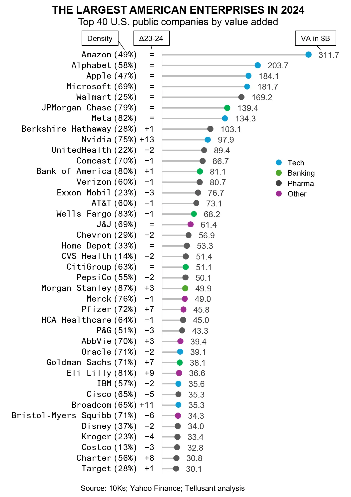

# America's Largest Enterprises in 2024
Tellusant's second official America's Largest Enterprises Ranking in 2020s (ALERT) is out. It ranks the largest U.S. companies by value added (VA)—economist's preferred way to measure size—and a better method than ranking by revenue like Fortune does.

**Amazon** maintains its lead at the top in 2024 and is the clear #1.

We start by presenting the results, which is what most people are interested in. After this follow definitions and methods.

## The Ranking

The ALERT list for 2024 is shown in the graph below. Companies are ranked by value added. We also show the position change from previous year (Δ23-24), and the ratio of VA to revenue, which we call Density.

Note that it is neither good nor bad to be large from a performance perspective. Having high or low density has no impact on performance either. Our list is only for informational purposes.

What jumps out from the analysis? We see a few themes:

## The Tech Juggernaut

The U.S. has by far the most vibrant tech sector in the world. Many countries have entrepreneurs and startups, but only the U.S. has managed to scale a few such companies to become 6 out of the top 10. Facebook, now Meta, was founded 20 years before the 2024 list. Google, now Alphabet, a few years earlier.

This success is not self-made by the younger companies. They stand on the shoulders of earlier giants like Hewlett-Packard, IBM, and Microsoft (still in the race), Intel, or Texas Instruments.

## The Churn

There is constant churn of the largest companies in America. Over the decade, expect half of the companies to be new entrants. A defining characteristic of capitalism is the reallocation of capital to the best opportunists.

2024 shows this with significant movements in the list. Over a decade, expect half of the companies to be new entrants. A defining characteristic of capitalism is the reallocation of capital to the best opportunists.

2024 shows this with significant movements in the list. See how **Nvidia** gained 13 places and is now at number 9, up from 22. **Broadcom**, a competitor to Nvidia, joined the forty at number 34, up 11 places. **Eli Lilly**, **Pfizer**, and **Charter Communications** also rose quickly.

**The Coca-Cola Company**, **Lowe's**, and **Elevance Health** left ALERT. It is hard to see them rejoining unless they make large acquisitions.

## The Top
**Amazon** has the honor of being the largest company in 2024 as it has for a few years. 

**Alphabet**. is a solid no. 2. Few know that Alphabet is such a behemoth. Large, yes, but the second largest? Revenue rankings deceive (no. 7).

**Apple** is somewhat stagnant in 2024 at no. 3. Microsoft is likely to pass in 2025 to claim the no. 3 spot.

**Walmart** has surprising longevity. That a retailer can be in the top five is remarkable. On the one hand, it still has growth opportunities in the U.S. (e-commerce and more). On the other hand, it has succeeded in building a position globally.

**JPMorganChase** is by far the largest financial institution. It is truly an excellent company with more or less flawless execution and an ability to shift priorities within its strategic framework.

**Nvidia** continuous to show extraordinary growth and profitability based on AI chips. Nothing like it has ever been seen. It reached the no. 9 spot this year. In 2023 it was no. 22, and no. 79 in 2022. An astonishing performance, but not surprising. On current form, it is likely to become America's largest company, perhaps in 7-8 years. 

## The Notables
**Berkshire Hathaway** is slightly moving up the ranks. Like General Electric many years ago, its performance defies logic. It is likely to fade and be broken up over the next decade.

**Pfizer** has turned around after plunging due to its dependence on Covid-related revenue. As the CEO said: _First, the hard truth. We missed our initial projections, largely due to the decline in sales of our COVID-19 products_.

Consumer goods have all but disappeared from the list. Only **Procter & Gamble** and **PepsiCo** remain.

Finally, how much did ALERT grow between 2023 and 2024? 10.6%. That is, far above inflation. This growth came mainly from tech. Without tech, the growth was 6%. Still a major achievement since inflation was 2.5%.

Notable growth companies beyond Nvidia and Broadcom, are Amazon , Pfizer and Eli Lilly and Company.

## Comers and Goers
New to the list in 2024 are **Broadcom**, **Charter Communications**, and **Target**. **Lowe's**, **The Coca-Cola Company**, and **Elevance Health** left the list.

## Definitions
There are at least five ways to define corporate size:

- Value Added (VA)
- Assets (net operating assets)
- (number of) Employees
- Revenue
- Cash Flow (free cash flow)

The first three — VA, assets, employees — tell a size story. Revenue does not, while cash flow is too variable to be useful.

Why not revenue, which is so often used? Consider the following example:

Let us say that you sell us a pen for 1 trillion and 1 dollars (1,000,000,000,001). We immediately sell it back to you for 1 trillion dollars.

You have suddenly created the world’s largest company by revenue (and we the second largest). Yet your value added is only 1 dollar; not noteworthy.

In real life, trading companies are close to the example: enormous revenue, little VA. Distributors are next, followed by retailers. Banks and biotech, on the other hand, have high VA relative to revenue.

In our analysis that resulted in the list of 40 the largest companies, **CostCo** has 13% VA as share of revenue. **Morgan Stanley** has the highest ratio at 87%. We call this density (see below).

Thus, revenue is a meaningless metric for comparing companies.

## Methods

What is VA for a company? It is what is created internally. This is the sum of labor and capital that belong to the company. It excludes external purchases, which are VA of other companies. VA = revenue minus purchases = labor plus capital expenses (including tax payments). We call this General VA.

The sum of VA from companies and other entities in a country equals gross domestic product.¹

VA is the preferred size metric of governments and economists, who hardly look at revenue.

In our case, we use Specific VA. This differs from General VA by excluding non-asset specific activities. With this, VA equals operating profits plus operating expenses (with some adjustments). This in turn is gross profit in most cases.²

Specific VA = Operating profits + Operating expenses = Gross margin

120 companies were evaluated for calendar year 2024. If their fiscal year differ from calendar year³, we use the sum of the four quarters nearest to December. If companies have off-quarter reporting⁴, we use the quarters closest to the calendar year (thus maximum one month off).

---
This concludes this year's review of the largest companies. This is now an annual release by Tellusant.  

[2025-03-20]
