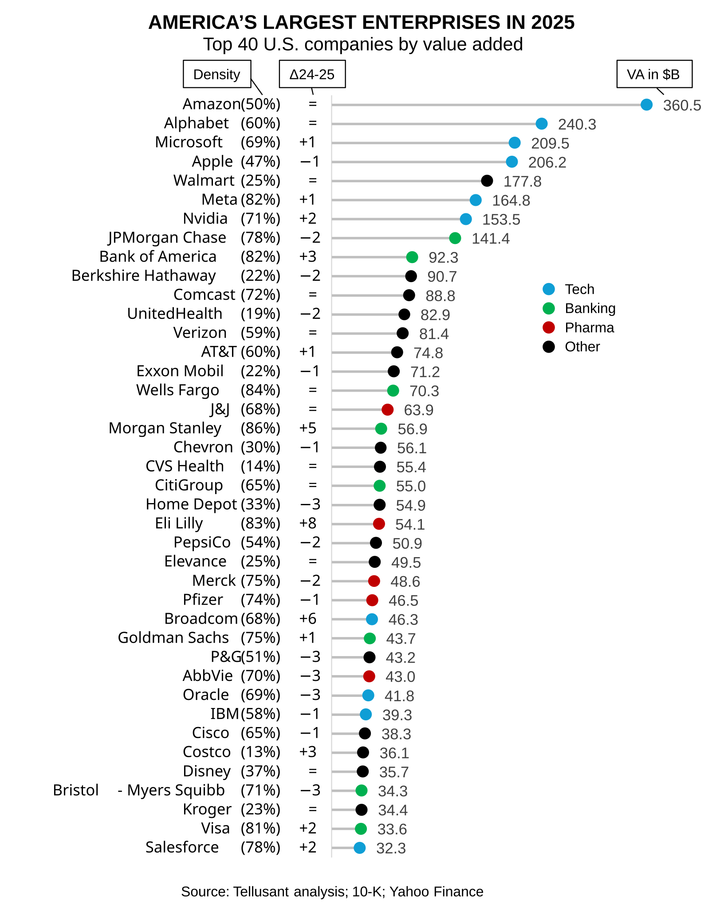
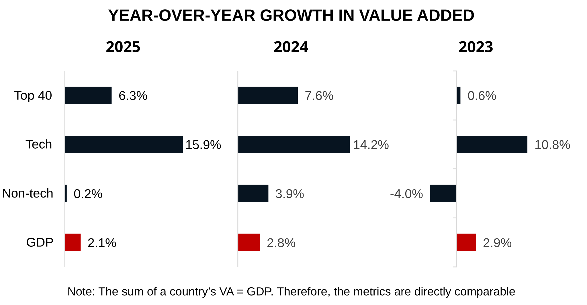

# America's Largest Enterprises in 2025
Tellusant's third official **America's Largest Enterprises Ranking in the Twenties (ALERT)** is out. It ranks the largest U.S. companies by value added (VA)—economist's preferred way to measure size—and a better method than ranking by revenue like Fortune does.  

Amazon maintains its lead at the top in 2025 and is the clear #1.  

We start by presenting the **results**, which is what most people are interested in. After this follow **definitions** and **methods**.  

## America's Largest Enterprises
The **ALERT** list for 2025 is shown in the graph below. Companies are ranked by value-added (VA). We also show the position change from previous year (Δ24-25), and the ratio of VA to revenue, which we call density.  

Note that it is neither good nor bad to be large from a performance perspective. Having high or low density has no impact on performance either. Our list is only for informational purposes.  

What jumps out from the analysis? We see a few themes:  

### The Tech Juggernaut  
The U.S., with China, have by far the most vibrant tech sectors in the world. Many countries have entrepreneurs and startups, but only the U.S. has managed to scale a few such companies to become 6 out of the top 10. **Meta** was founded 21 years before the 2025 list. **Alphabet** a few years earlier.  

This success is not self-made only by the younger companies. They stand on the shoulders of earlier giants like Hewlett-Packard, IBM, and Microsoft (still in the race), Intel, or Texas Instruments.  

### The Top  
**Amazon** has the honor of being the largest company in 2025 as it has been for a few years. Note that Amazon changed its accounting practice in 2024. Before this change, it was no. 5. We believe the new accounting practice reflects reality better.  

**Alphabet** is a solid no. 2. Few know that Alphabet is such a behemoth. Large, yes, but the second largest? Revenue rankings deceive (no. 7).  

**Microsoft** passed Apple to reach no. 3. Cloud solutions and data centers are the main reasons.  

**Apple** is somewhat stagnant in 2025 and dropped to no. 4.  

**Walmart** has surprising longevity. That a retailer can be in the top five is remarkable. On the one hand, it still has growth opportunities in the U.S. (e-commerce and more). On the other hand, it has succeeded in building a position globally.  

**Meta** is holding up well. Social media may be in decline, but Meta's ability to monetize its user base is astonishing. It is one a few companies that appear to apply AI at scale.  

**Nvidia** continuous to show extraordinary growth and profitability based on AI chips. Nothing like it has ever been seen. It reached the no. 7 spot in 2025 (no. 9 in 2024, no. 22 in 2023, no. 79 in 2022). An astonishing performance, but not surprising. On current form, it is likely to become America's largest company, perhaps in 7-8 years.  

**JPMorgan**. is by far the largest financial institution. It is truly an excellent company with more or less flawless execution and an ability to shift priorities within its strategic framework.  

### The Notables

**Eli Lilly** is racing up the ranking. It is now the second largest pharma company. Who would have thought this was possible ten years ago.

**Morgan Stanley** and **Goldman Sachs** moved up the list based on solid performances. They outpaced other financial institutions.

**Berkshire Hathaway** is slipping a bit. Like General Electric many years ago, its previous performance defies logic. It is likely to fade and be broken up over the next decade.

Consumer goods have all but disappeared from the list. Only **Procter & Gamble** and **PepsiCo** remain.

Outside the list, **General Motors** and **Ford** had the worst performances of all companies we track. The tariff chaos and supply chain woes are likely reasons. On the positive side, **AMD** did really well.

### Comers and Goers
New to the list in 2025 are **Visa** and **Salesforce**. **Charter Communications** and **Target** left the list.

---

