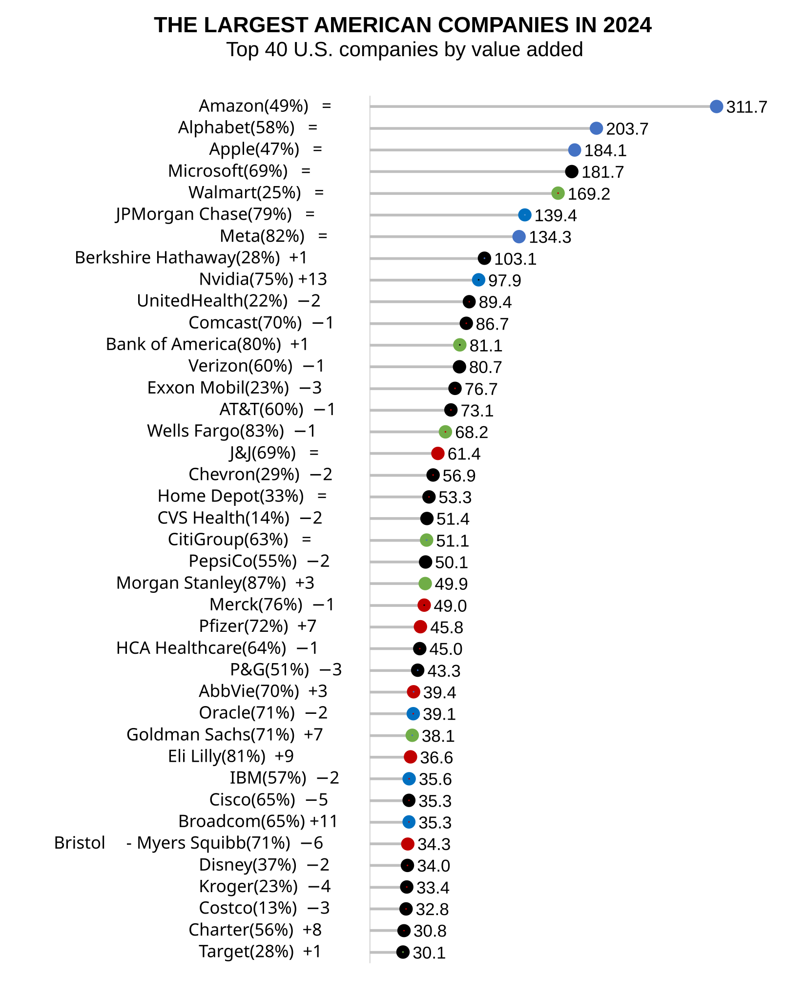

# America's Largest Enterprises in 2025

*Under development as reports come in. Two missing late March 2026*

Tellusant's third official America's Largest Enterprises Ranking in 2020s (ALERT) is out. It ranks the largest U.S. companies by value added (VA)—economist's preferred way to measure size—and a better method than ranking by revenue like Fortune does (shown later in this document).

**Amazon** maintains its lead at the top in 2025 and is the clear #1.

We start by presenting the results which is what most people are interested in. After this follow definitions and methods.

## The Ranking

The ALERT list for 2025 is shown in the graph below. Companies are ranked by value added. We also show the position change from previous year (Δ24-25), and the ratio of VA to revenue, which we call density.

Note that it is neither good nor bad to be large from a performance perspective. Having high or low density has no impact on performance either. Our list is only for informational purposes.

What jumps out from the analysis? We see a few themes:

**Work in Progress**

## Definitions
There are at least five ways to define corporate size:

- Value Added (VA)
- Assets (net operating assets)
- (number of) Employees
- Revenue
- Cash Flow (free cash flow)

The first three — VA, assets, employees — tell a size story. Revenue does not, while cash flow is too variable to be useful.

Why not revenue, which is so often used? Consider the following example:

Let us say that you sell us a pen for 1 trillion and 1 dollars (1,000,000,000,001). We immediately sell it back to you for 1 trillion dollars.

You have suddenly created the world’s largest company by revenue (and we the second largest). Yet your value added is only 1 dollar; not noteworthy.

In real life, trading companies are close to the example: enormous revenue, little VA. Distributors are next, followed by retailers. Banks and biotech, on the other hand, have high VA relative to revenue.

In our analysis that resulted in the list of 40 the largest companies, **CostCo** has 13% VA as share of revenue. **Morgan Stanley** has the highest ratio at 87%. We call this density (see below).

Thus, revenue is a meaningless metric for comparing companies.

## Methods

What is VA for a company? It is what is created internally. This is the sum of labor and capital that belong to the company. It excludes external purchases, which are VA of other companies. VA = revenue minus purchases = labor plus capital expenses (including tax payments). We call this General VA.

The sum of VA from companies and other entities in a country equals gross domestic product.¹

VA is the preferred size metric of governments and economists, who hardly look at revenue.

In our case, we use Specific VA. This differs from General VA by excluding non-asset specific activities. With this, VA equals operating profits plus operating expenses (with some adjustments). This in turn is gross profit in most cases.²

Specific VA = Operating profits + Operating expenses = Gross margin

120 companies were evaluated for calendar year 2024. If their fiscal year differ from calendar year³, we use the sum of the four quarters nearest to December. If companies have off-quarter reporting⁴, we use the quarters closest to the calendar year (thus maximum one month off).

---
This concludes this year's review of the largest companies. This is now an annual release by Tellusant.  

---
[2025-03-20]  
[Find more articles and posts](index.md)
