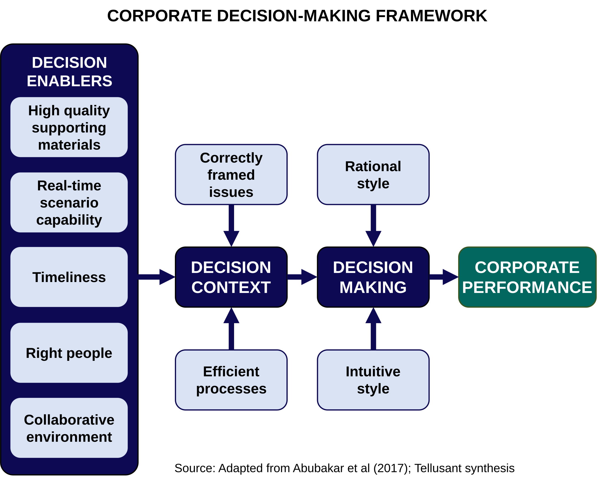

# Tellusant's Corporate Decision-Making Framework

Companies are often described as decision factories. Based on the academic literature and extensive interviews, Tellusant created this decision-making framework.

  

## Decision Enablers
Decisions are not made in a vacuum. There are five enablers that dictate the quality of decisions:

- The quality of supporting materials is a key enabler of good decision making. Our interviews show that decision makers almost uniformly would like to see an improvement of the underlying materials.
 
- Scenarios should be possible to run in real time. Most executives find this lacking. Instead, a new scenario make take up to 2–3 days to run for the business analysts.

- Decisions should be timely. Often, decision making takes too long. A typical strategic planning process takes 3–5 months. Some issues seen at the outset may not be material by the end, and new issues may have emerged.

- The right people have to be involved. T-shaped expertise is required: some should be generalists with broad experience, while some should be specialists with deep knowledge.

- A collaborative environment is an important enabler. Executives are more committed when heard.

## Decision Context

The enablers lead to to a decision context:

- The most important pain point we heard in our interviews was that the issues to be decided on were not framed correctly, or not at all. Instead the decision making process (e.g., for the strategic plan) became a process of checking the numbers.

- The decision processes are usually viewed as inefficient, especially in higher level processes like strategic planning, even though outcomes may be good.

## DECISION MAKING

The actual decision making flows from the enablers and the context. There are two ways of making business decisions: rationale and intuitive.

- Rationale decision making has gradually become more important over the last century. This is because executives are now better educated and much more information is available in digestible form.

- But, intuitive decision making is important and will continue to be so. When rational decision making becomes more efficient, there is more space to have higher quality in intuition.

## Corporate Performance

Improving high level decision making like strategic planning is often the highest ROI effort available to a company.

1. More effective decision processes will save money. There are 0.7M corporate planning analysts in the United States and 2.5M worldwide who support decisions.

2. Resource allocation is improved with better decisions. This is especially true of the decisions coming out of strategic planning cycles. This leads to top line growth which over time adds up to a major benefit for the company.

3. Consistency across geographies and business units is improved. Currently, there are too many methods and approaches in a global company, making it hard for executive leadership to compare opportunities and set priorities.
