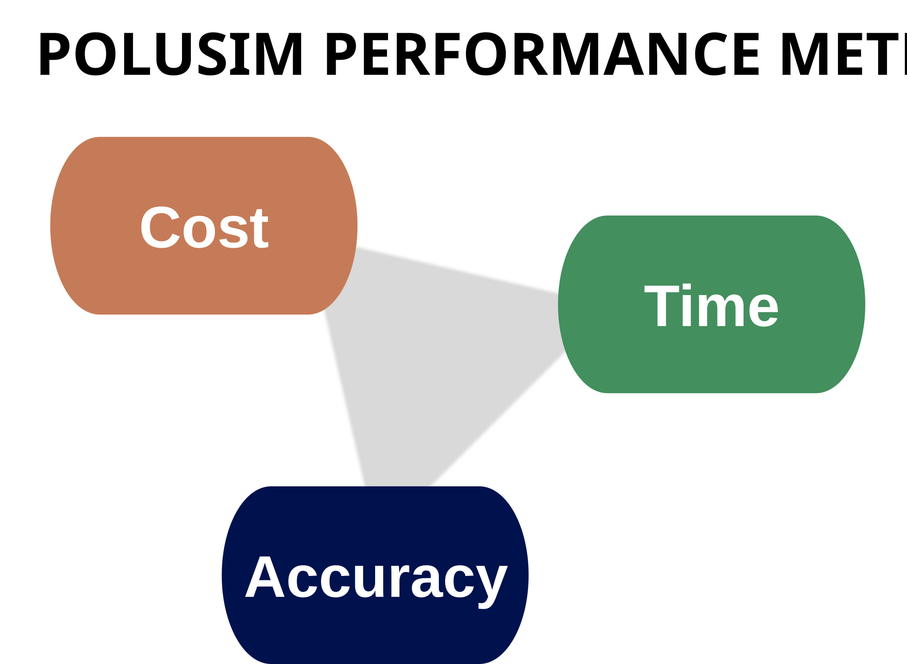

# PoluSim Performance Metrics: Cost–Time–Accuracy

Our **PoluSim** forecasting solution is widely appreciated by customers around the world. The relevance to top management is high since it simplifies global and local forecasting under a uniform umbrella.  

We optimize it around three enterprise performance metrics to maximize relevance:  

<figure>

<figcaption class="unseen">PoluSim Performance Metrics: Cost–Time-Accuracy</figcaption>
</figure>

Forecasting is often discussed around predictive accuracy. But for enterprises, the cost and time savings are at least as important to maximize relevance.  

- **Cost** savings from higher efficiency  
- **Time** reduced in turning around forecasts  
- **Accuracy** of forecasts  

## Cost
A new enterprise solution has to lead to cost savings and better workflows. If this does not happen, the solution can be ever so good. It will not matter.  

We recommend implementing our PoluSim solution and using them over one planning cycle, perhaps in parallel with existing solutions. In the second cycle, PoluSim is the only solution.  

***Old forecasting tools should be decommissioned***. By doing this, major efficiencies will be realized both at the local operating company level, and at regional and global headquarters.  

## Time
PoluSim shortens the turnaround time for generating forecasts. Before PoluSim it would take weeks, if not months, to reach a point where forecasts were agreed. With PoluSim, this can be achieved in three sub-week cycles. Cycles 1 and 2 receive feedback from senior management, cycle 3 finalizes the forecasts. In total, less than 2 work weeks are spent on the forecast.  

***Old long planning timelines should be scrapped***. By doing this, true agility will follow.  

## Accuracy
Achieving high accuracy is a given. The predictions have to be robust enough that everyone agrees: "this is as good as we can do it". Accuracy and model validation is important during the first year; later this should be routine, automated follow-ups. There will always be learnings to enhance of PoluSim.  

_**Old improvised local approaches shall be banished, yet local insights shall be captured**_. By doing this, the enterprise will move in sync with shared expectations.  

---
We suggest having this mindset when installing PoluSim. It should be part of new digital and AI based solutions aiming at transforming the enterprise and its workflows, far beyond just being accurate.  

It is part of a management revolution not seen since the advent of the mult-divisional enterprise more than a hundred years ago.

---
*AI was not used.*

[See our collection of thought pieces on predictive model theory](predictive-model-collection.md)  
[Find more articles and posts](index.md)
