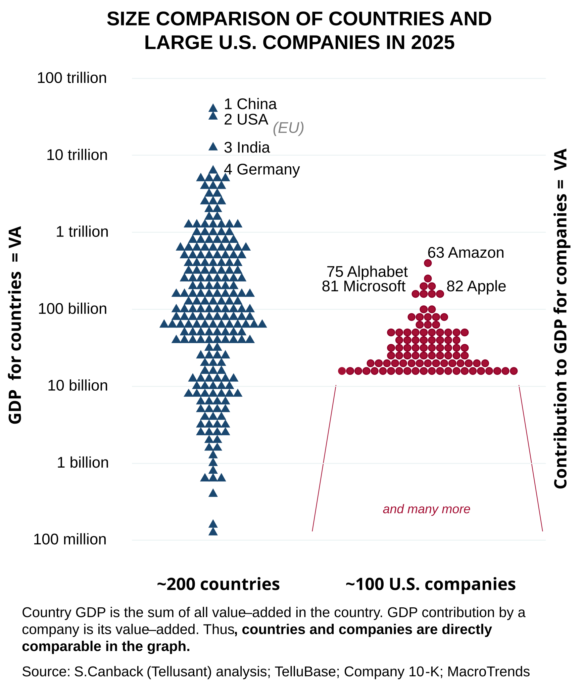

# Comparing Country and Company Size: Value-Added (VA) as the Common Metric
*Dr. Staffan Canback, Tellusant*

Our ***Paragonal*** database quantifies productivity of countries, companies, and their business units. As a by-product of this, it measures [value-added](value-added.html) of both countries and companies. This allows for a direct comparison of size.

Companies are sometimes compared to countries based on revenue versus GDP. But revenue is a different measure of GDP. It is like comparing current (ampere) with weight (kilogram), they have nothing to do with each other.

The graph below shows our ranking. With the common matric of value-added, Amazon is the largest U.S. company and ranks no. 61 if it were a country in 2025. Slightly below Ethiopia and Venezuela, and slightly above Finland and DR Congo.

The other large U.S. companies are shown in the violin plot, as are all 218 countries and territories in the world. (Note that there are many companies smaller than the companies we show.)

There is no message in the chart except that one should measure the right things. Throw GDP/revenue rankings in the garbage can.
