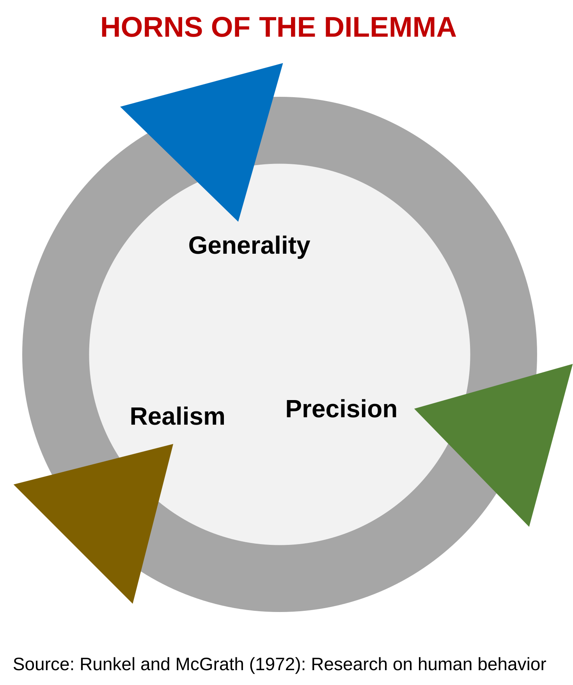

# The Horns of the Dilemma 1
In strategic planning efforts, the team responsible has to decide upfront what it wants to achieve. 

  

A strategic plan can prioritize general results (e.g., a global opportunity assessment), precise results (e.g., a market entry strategy plan for one country), or realistic results (e.g., ethnographic perspective of customer behavior).  

The issue is that it is impossible to cover all three at the same time no matter how much effort is expended. This is called the "horns of the dilemma" problem.  

Senior executives tend to prefer generality. Junior employees often think in terms of precision or realism. But many people have no structured way to think about the dilemma and want it all.  

[2021-09-04]
