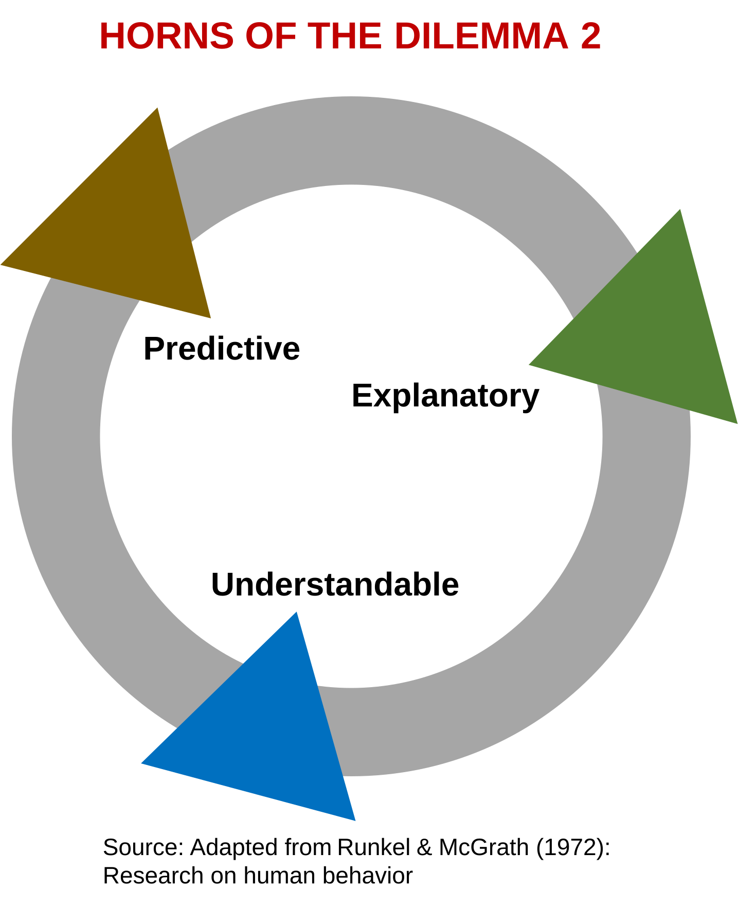

# The Horns of the Dilemma 2
*Dr. Staffan Canback, Tellusant*  

When working with large comapnies, we often encounter people who want everything from statistical analyses. They want a model to predict well, to explain what is going on (the drivers), and to be understandable by them as non-experts.

This is imposiible to achieve. The framework below shows the trade-off between these three factors. The framework is my adaptation of the *Horns of the Dilemma* framework for research in sociology (including management science).¹

  

- **Predictive versus explanatory**. The best predictive models are often timeseries (moving average) based. They have no independent variables, so they explain nothing. Non-statisticians find this disturbing. How can you predict well but not be able to explain what makes the model work?  

&nbsp;&nbsp;On the other hand, it is relatively easy to create models with high explanatory power, but they do not predict anything. An extreme case is an over-fitted regression model with many indepemdent variables. It may give an R-squared of 0.05, but when put to the predictive test (e.g., with MAPE), it is bound to fail.

---
¹ Note that not everyone can propose frameworks. Only the authorities can. That is, people with a long and distinguished career in the subject matter, typically associate and full professors or their equivalents. I consider myself such an authority in this knowledge domain, so hence my framework that is new.  

I learned this the hard way 25 years ago. Early in my doctoral studies I suggested a framework. A professor said "who are the authorities you cite for this framework?" I said "I created it." He responded " how dare you compare yourself to the authorities? You are are a lowly doctoral student and cannot offer anything. Prove yourself first."

[2025-11-07]
