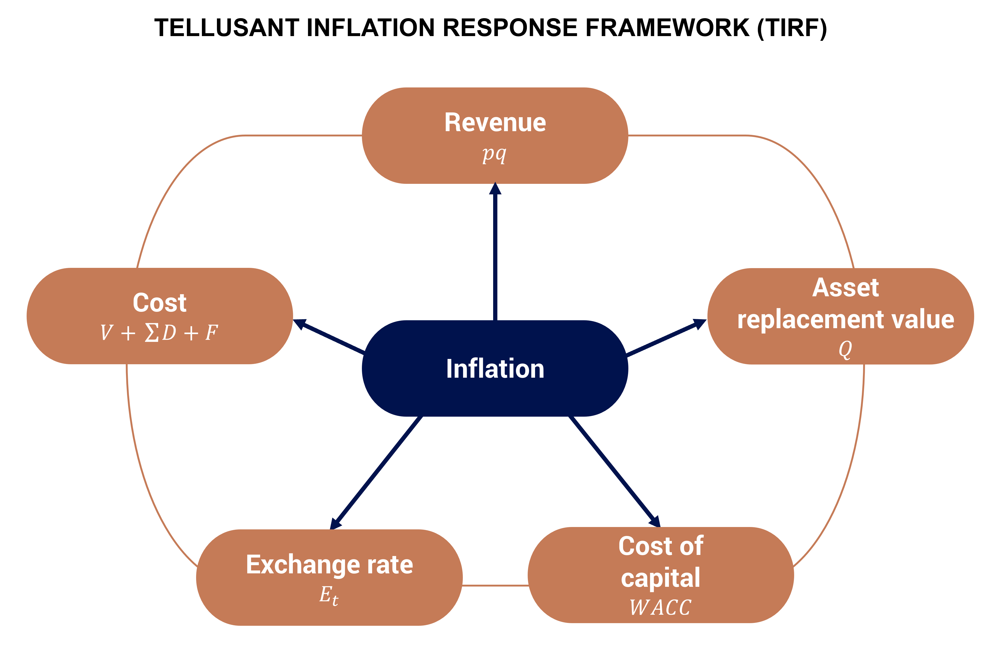

# CEO Actions When Inflation Hits — Our Checklist (Part 5 of 5 on Inflation Management)
<a href="{{ site.related_sites.canback.url }}" target="_blank" style="color: black; text-decoration: none;"><i>By {{ site.related_sites.canback.name }}</i></a>, <a href="{{ site.company.url }}" target="_blank" style="color: black; text-decoration: none;"><i>{{ site.company.name }}</i></a>
 <span> | </span>*2022-07-28*

What should CEOs do when high inflation suddenly is the norm? Certainly not manage as usual.

Structured, integrated inflation management is required. What must be done is not complicated, but it is easy to omit levers.

Here we prescribe an integrated framework for action based on our considerable experience with this topic.

Building on previous posts in this series on inflation management, we discuss:  

- Tellusant’s integrated inflation response framework  
- Inflation management levers  
- The path forward  

## Tellusant’s Inflation Response Framework (TIRF)
Inflation management is a multifaceted task for a CEO. We created TIRF based on academic literature to give an integrated view on what levers to pull.

<p align="center">

</p>

The five elements are all influenced by the same inflation rate. It is important that the same inflation assumptions feed into each of these levers.

The framework is the starting point for discussions within the C-suite, business units, and geographic units. It also points to what various executives need to report back on to headquarters.

Once the company has quantified and operationalized TIRF, the results should feed into an update of strategic and financial plans.

How long does implementing TIRF take? In a large company around one month if the automated tools are available and appropriate processes are in place. Longer if the current planning processes are based on “Excel-Powerpoint-Email.”

Next, we discuss each of the TIRF levers.

## Inflation Management Levers
Revenue and cost were discussed in [Part 4](inflation-4.md) of this series. We add a few observations here. The three other levers are new.

### Revenue
***First***, companies should track inflation-adjusted sales for internal purposes (how to communicate with the stock market is another matter). It is easy to believe one has increased sales when the real reason is inflation.

For multinational companies that track country sales at market exchange rates, the consolidated revenue should be deflated by the inflation rate in the home country. The exchange rate already captures the differential inflation between countries and home).

For those using fixed exchange rates for the year, an adjustment for the differential exchange rate between country and home is necessary.

The inflation metric should be the CPI. It is more up to date than the GDP deflator, which otherwise would be the better metric.

> What does it mean for the CEO? Make sure inflation-adjusted revenues are the metric for setting targets and are tracked monthly.

***Second***, in [Part 4](inflation-4.md) we discussed how to make the trade-off between price and advertising. This does not imply that price cuts are the only way to optimize pricing.

The framework below points to additional possibilities.

[g]

We expand on the framework in a [separate article](https://medium.com/tellusant/pricing-mechanisms-for-managing-through-inflation-da6f6a234259?source=friends_link&sk=7305c2a8d7e608e89d13eee184a60997). For now, we point out that regular price cuts or promotional spending are not the only possibilities.

Importantly, premiumization is sometimes possible in inflationary times if the right consumer groups are targeted.

The leadership of a company needs to ensure these WisePrice levers are evaluated and acted on in business units and in countries.

### Cost
Here are some additional recommendations beyond what was covered in [Part 4](inflation-4.md) of this series.

In inflationary times it is important to track variable and fixed costs diligently.

***First***, many companies do not make the split in an informed manner. They tag cost items by the fixed or variable bucket based on experience. This may however underestimate variable cost.

Instead, regression analyses should be performed to find the true split. Below is such an analysis for ten companies.

[g]

The level of variable cost may be surprising.¹ But note that short term (current year) variable cost usually is lower. (We save this analysis for our customers.) Nevertheless, variable cost is usually higher than executives believe.

***Second***, this split into true variable or fixed cost has profound impact on the understanding of future profitability. It makes it possible to make the current year budget (of utmost importance when inflation is high) much more accurate.

> What does it mean for the CEO? Make sure sensitivity analyses of budgets are based on true fixed / variable numbers. Never use EBITDA as a proxy.

### Asset Replacement Value
One may think that assets bought at a lower price before inflation sets in is an advantage. The book value takes up less and less space on the balance sheet.

But the stock market is not concerned with book value. It looks at replacement value for the machines, buildings, trucks, and other physical assets. Tobin’s **Q** sets this out:

[g]

**Q** is widely used by economists, less so by businesses. It shows that the relative value of a company declines if replacement value increases, but profitability and growth (the parts that combine to create market value) do not keep up.

When inflation is high, replacement values go up quickly. This increases the asset-burden profits need to support. In the U.S., and other countries, company market values tend not to keep up with the asset replacement cost and **Q** falls.

1968–1980 in the graph below illustrates the point.

[g]

A detailed Tobin’s **Q** graph is found [here.](https://www.advisorperspectives.com/dshort/updates/2026/09/11/qratio-market-valuation-august-2026)

> What does it mean for the CEO? Make sure replacement values are reported quarterly so that the budget expectations on profitability and growth can be adjusted.

### Exchange Rates
Too many companies think only of exchange rates in nominal terms. A CFO we know said “Why am I always negatively surprised by the exchange rate when I look at our East African companies?”

The reason was that inflation was higher in those countries than in the home country. That those currencies declined was a healthy sign that the currency markets worked.

The market exchange rate view is important. It is how companies report financial statements publicly.

But for internal purposes the real (inflation-adjusted) exchange rates should be used. These are called *RERs*.

The graph below from [**Q-Risk**](https://docs.tellusant.com/work-notes/corporate-operating-risk-2.html), our quantitative risk product which includes real exchange and inflation, shows an example:

[g]

> What does it mean for the CEO? Make sure the finance unit tracks RER and that they are applied when comparing countries. This is especially important for forward-looking plans like strategies and budgets. It also means that the company needs to have a perspective on future inflation.

### Cost of Capital
Finally, cost of capital is related to inflation. This affects both WACC and project hurdle rates.

For simplicity, assume a company that has no debt; it is thus financed by equity. Then the cost of capital equals cost of equity Kₑ $Ke$:

[g]

Without going into financial theory, the risk-free rate is essentially the same as future inflation. Thus, capital cost increases with inflation.

This means that companies should update cost-of-capital tables. It also means (re-)learning how to perform discounted cash flow calculations under inflationary conditions. This is quite different from what most companies are used to.

> What does it mean for the CEO? Make sure to review the current investment / project portfolio. Previously profitable acquisitions or projects may have become unprofitable.<sup>2</sup>

## The Road Forward
CEOs need to energize executives to meet the inflation management challenge in a robust and scientific manner. Our TIRF approach is an organizing framework.

The CEOs agenda does not need to be clogged. It is for the CEO to *initiate* proposals for action. Then the board *ratifies* those and/or other actions. Units *implement* the chosen actions. Finally, the board *monitors* the outcomes.<sup>3</sup>.

Many of the suggested CEO actions will have to be handled manually and will take time. This is a shame because most of this is possible to automate. However, large companies are far behind the curve on such automation.
 
```This was written before LLMs. Today, four years later, the automation possibility is real. But large companies are still behind the curve.```

---
Tellusant is building its strategy management software to be able to handle such automation tasks. Instead of spending months and activating hundreds of people, much of the task is handled quickly and cost-efficiently.

Tellusant’s expertise and suite of products help companies handle high inflation effectively.

---
<sup>1</sup> We also performed the analysis using the primitive hi-lo method. Its correlation with the regression method is 0.76.

<sup>2</sup> In fact, the main conduit for reducing inflation in a country is by reducing investments.

<sup>3</sup> *Initiation — Ratification — Implementation — Monitoring* is the famous decision process defined by Eugene Fama (Nobel Prize winner) and Michael Jensen (the most cited economics academic ever) in 1983. IRIM has other names too, but they are all copycats of the original. [Fama, E.F. and M.C. Jensen: *Separation of Ownership and Control*](https://www.jstor.org/stable/725104)
