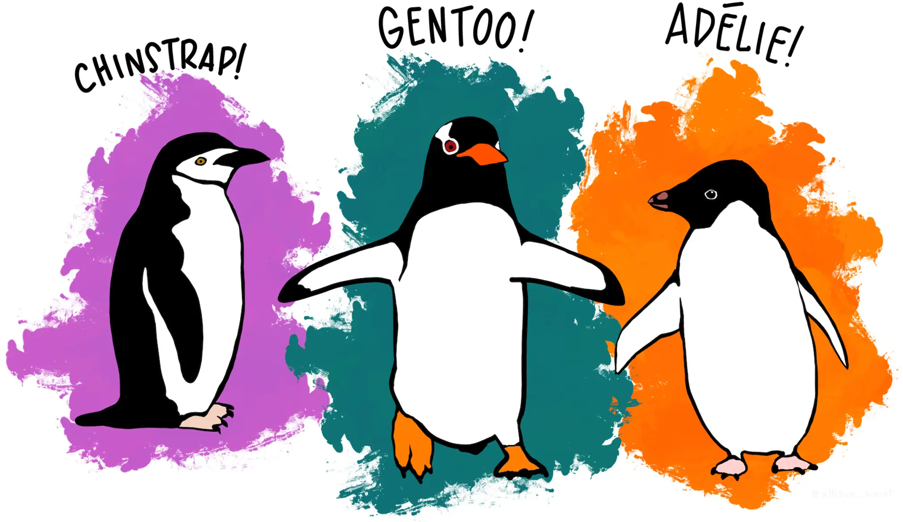

# The Palmer Penguins and their Role in Business  
***Dr. Staffan Canback***  

  Artwork by @allison_horst

textttt

#### [The Palmer Penguin Dataset and Art](https://github.com/allisonhorst/palmerpenguins/blob/main/README.md)
