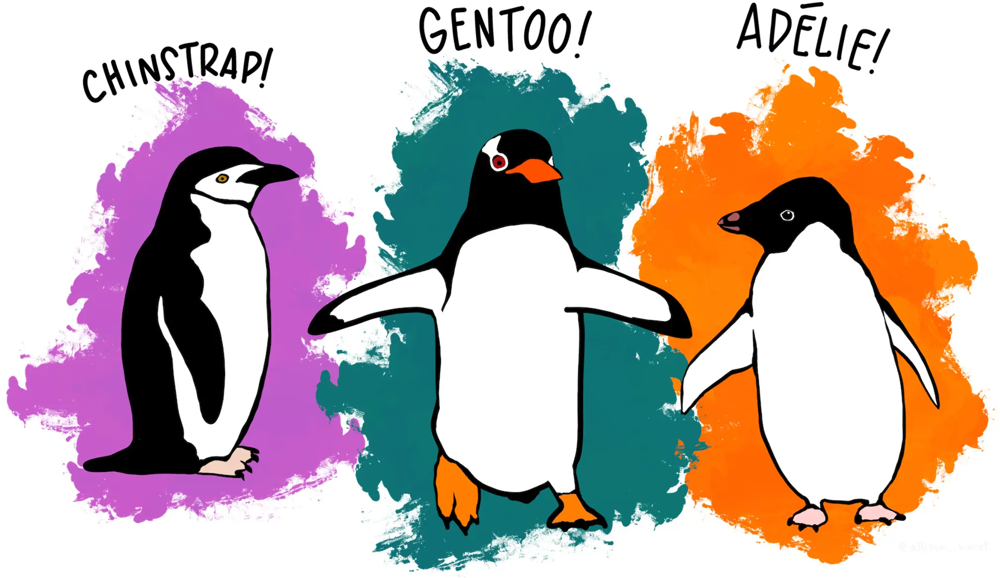
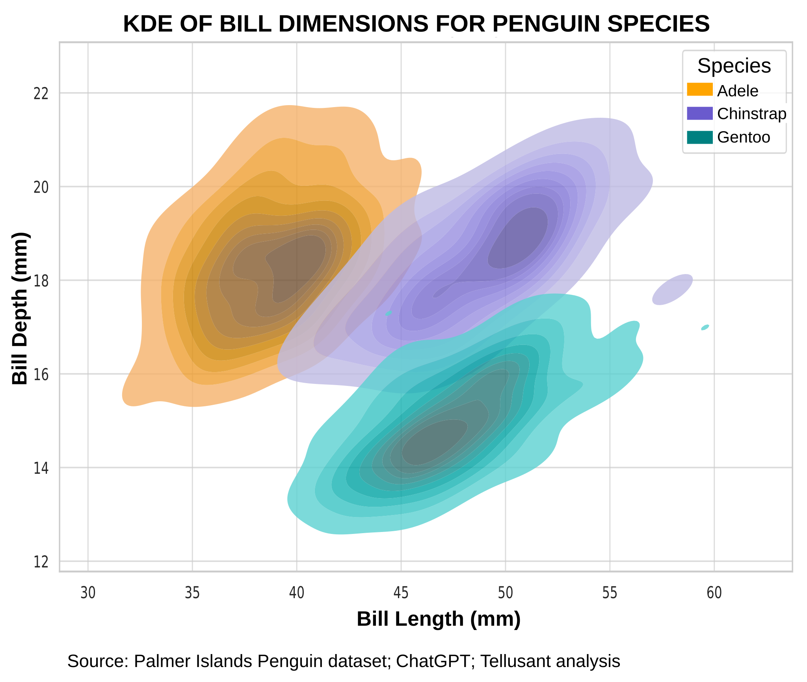

# The Palmer Penguins and their Role in Business  
***Dr. Staffan Canback***  

---

  Artwork by @allison_horst

Penguins are an unlikely influence on management science, but this dataset has had a profound impact on machine learing and artificial intelligence, and by extension on emerging business practices.

### Background
In the early 2000s, a research team worked at the Palmer Research Station in Antarctica to better understand "ecological sexual dimorphism and environmental variability within a community of Antarctic penguins."

The work had nothing to do with machine learning or artificial intelligence. However, the data collected turned out be truly usful for AI scientists to create learning models, as well as for countless high school and college students who are learing the basic concepts of AI.

### The Dataset and Its Uses
The Palmer dataset consists of observations of 344 penguins covering 3 species. 

#### How Tellusant Uses These Methods
tbd

---
Find the original data: **[The Palmer Penguin Dataset and Art](https://allisonhorst.github.io/palmerpenguins/)**

Source: Horst AM, Hill AP, Gorman KB (2020). palmerpenguins: Palmer Archipelago (Antarctica) penguin data.  R package version 0.1.0.

