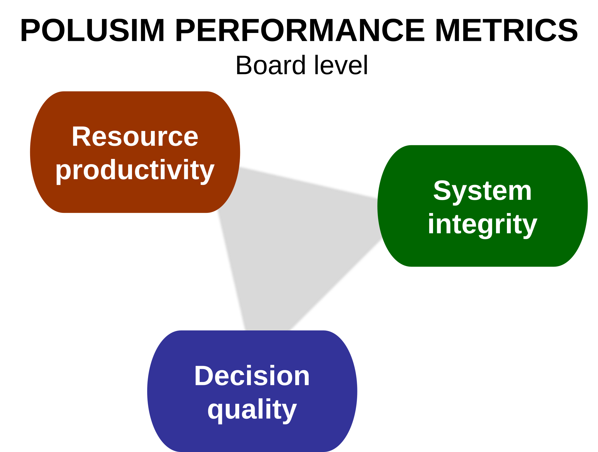
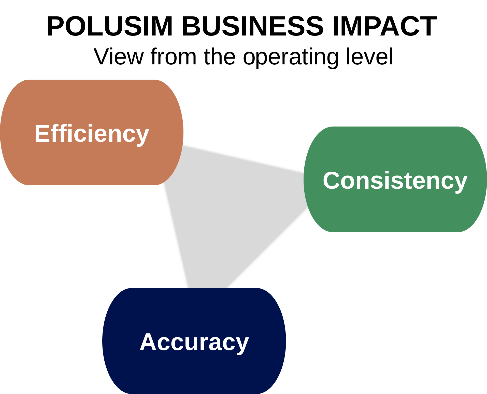

# PoluSim Business Impact: Board Room and Operating Level Views

Our **PoluSim forecasting solution** is widely appreciated by customers around the world. A key reason is that we design it for business impact.

We optimize it around three enterprise performance dimensions to maximize the impact.

We discuss this business impact from two vantage points:
- The board room
- The operating level

The two views stem from the same reality, but the board room view is more holistic and complex than the operating-level view. 

## Board Room Logic and Language System

Board members have a different logic and language system than people at the operating level. They deal with higher levels of abstracion such as stragey, and assume that details are handled at lower levels.

They are interested in building competitive advantage over years to come (while keeping an eye on current performance). It is a world operational people often find puzzling and hard to navigate. Abstraction rules, rather than day-today practicalities.

The graph below shows what a board member is looking for in PoluSim.

For board members, PoluSim's relevance is that it leads to enterprise-wide improvements. It offers:  

- Higher **resource productivity**  
- Increased **system integrity**  
- Improved **decision quality**  

These three elements are orthogonal. That is, they do not depend on each other and are uncorrelated. This means they can be discussed one by one, making for a nice compartmentalization of the opportunties at hand.

## Resource Productivity
PoluSim materially reduces the resources required to plan and forecast. By automating core analytical tasks and standardizing workflows, it shortens planning cycles, lowers the cost per forecast, and frees up managerial time for higher-value decisions. 

The result is not just efficiency in isolation, but a structurally leaner planning process that scales across markets without proportional increases in effort.

***Old forecasting tools should be decommissioned***. By doing this, major efficiencies will be realized both at the local operating company level, and at regional and global headquarters.  

## System Integrity
PoluSim establishes a single, coherent modeling logic across business units and geographies. Rather than relying on fragmented, locally developed approaches, the system enforces consistent structures, economically sound relationships, and transparent governance. 

This reduces discretionary overrides and ensures that decisions are based on comparable, internally consistent outputs—creating a unified analytical backbone for the enterprise.

***Old, improvised, local approaches shall be banished, yet local insights shall be captured.*** By effecting this, processes will be streamlined.

## Decision Quality
PoluSim enhances the reliability and usefulness of forecasts as inputs to decision-making. By improving accuracy, reducing bias, and increasing the stability of projections, it enables management to act with greater confidence. 

Decisions become less reactive and more forward-looking, grounded in a consistent and empirically validated view of demand, pricing, and market dynamics.

***Together, they represent new organizational capabilities that build the structural capital (TFP) of the enterprise.*** By pursuing this, resource allocation errors will be reduced.

## Operating Level Logic and Language

The language and scope at the oerating level differ from the board room, but have the same essence. The graph below shows the distinction.

- Higher **efficiency**  
- Increased **consistency**  
- Improved **accuracy**

**Efficiency,** *do more with fewer resources,* is more targeted than *resource productivity*. It speaks to the direct cost and time savings from implementing PoluSim, rather than he enterprise-wide impact.

**Consistency,** *get the same answer everywhere,* covers model standardization, parameter coherence, and override discipline (manual changes are tracked). It also includes compliance needs.

**Accuracy,** *get the answer right,* speaks to observed model performance rather than the decision-making quality that a board is looking for. It is less focus on judgmental biases, especially in the early implementation of PoluSim.

— — —

We suggest having these mindsets when installing PoluSim. It should be part of new digital and AI-based solutions aiming at transforming the enterprise and its workflows.  

It is part of a management revolution not seen since the advent of the mult-divisional enterprise more than a hundred years ago.

---
There is a third view, often promulgated by data scientists. It holds that a one-dimensional measure, accuracy, is what matters. We disagree with this view because it is too narrow, and frankly, pointless in isolation.

---
[See our collection of thought pieces on predictive model theory](predictive-modeling-collection.md)  

[Find more articles and posts](index.md)  

*ChatGPT was used for brainstorming.*  
