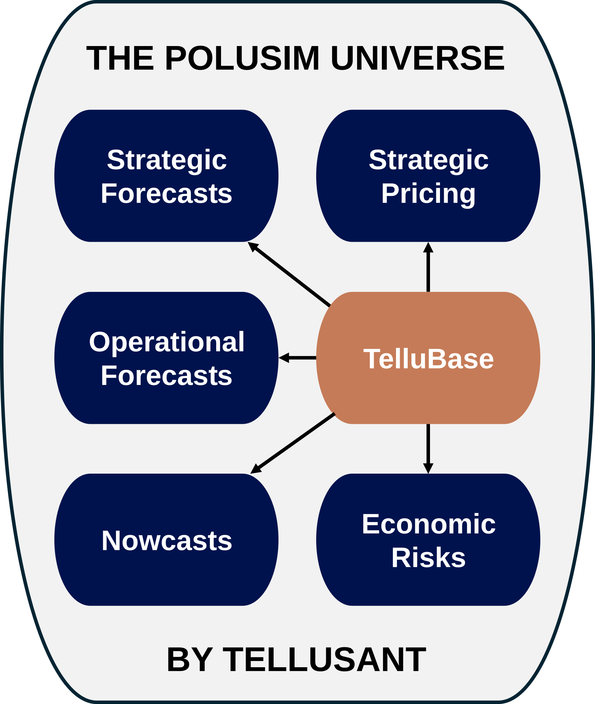

# The PoluSim Universe

## WIP. The starting point for a longer article.

Our **PoluSim** solution has expanded majorly since the launch in 2022. It now has three distinct modules plus **TelluBase** to help companies create a strategic view of the future and to predict demand.  

We have subscribers in more than 100 countries and are featured in clients' quarterly and annual reports, as documented by the SEC.  

  

- **Strategic forecasts**. This is where we started. Forecasting with a strategic 3-, 5-, or 10-year horizon is a) difficult, and b) done with unrigorous methods at all companies (as far as we know). We therefore built our cloud-based app on strictly scientific foundations.  

- **Strategic pricing**. Companies usually have solid price/promo pricing tools. But what should pricing decisions be aiming for strategically? Surely it is not the compounding of price/promo decisions. Our web-based solution helps answer this.  
  
- **Near-term forecasts**. This application helps senior management understand what awaits categories and their company over the next 18 months. It uses a monthly timeseries model combined with independent demand drivers. It is harmonized with our long-term forecasts.

- **Nowcasts**. Companies (and countries) rarely know where they are at here and now. Yes, they know the months sales (sell-out), but is it good or bad relative to the market as a whole, relative to the closest competitor, relative to trend cleansed of seasonality? Our nowcasts allows a company to now current status.

- **Economic risk**. This is a byproduct of TelluBase data. With some elegant math we show finanial and real-economy risk by country.

- **TelluBase** is our global database with consumer economics and income distribution data for 218 countries, 2600 cities, and 2500 subdivisions for 2000-2050. It feeds automatically into each PoluSim module. It is also available as a standalone product.  

These solutions are enterprise level tools. This means we meet the strongest security standards and we run on Azure. Connections with corporate data are safeguarded in a jointly approved manner. We do not allow AI for the time being.

***Most importantly***, success with our solutions requires full training and help desk support. We are on hand to support this and gradually transfer skills to internal experts.

Implementing **PoluSim** is a fundamental step forward for companies. It gives a competitive advantage, but also requires learning new skills. We look forward to helping you in this journey.

## The Tower of TelluBase
We show what is included in TelluBase in a simple 3D "tower", demonstrating its comprehensiveness. It makes clear what is unique about TelluBase compared to conventional data sources.

You will see that everything referring to distributional economics is completely unique to TelluBase. In strategy parlance, it is VRIO:
- **Valuable**. Demand for any product or category is 80-90% determined by hoesehold income distribution. TelluBase has this.
- **Rare**. No other company provides these data on a global basis.
- **Inimitable**. SInce the start in 2007, no one has been able to create a global product of TelluBase's magnitude and scope.
- **Organized**. We manage the database in a highly structured manner so that we do not are overly dependent on key personnel.

Conventional data sources tend to report back data they scrape from government and other sources without any value added except ease of access. TelluBase, in contrast, is a *managed* information resource.

For more on TelluBase, visit the [website](https://tellubase.com) or see our introductory [video](https://tellusant.com/repo/video/tellusant-tellubase-introduction.mp4).
