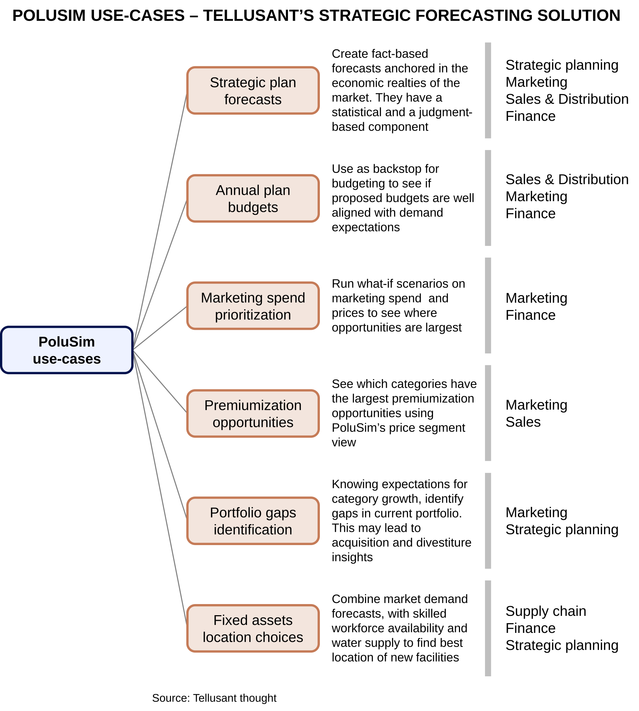

# PoluSim Use-Cases
PoluSim has multiple uses within large companies. Here we share summaries of six use-cases.  

The graph is self-explanatory. Below it we describe some additional considerations for the prime case at the top.

The heart of of PoluSim is the **strategic forecasting capability**, the prime use-case. The PoluSim platform allows companies to accurately, consistently and efficiently see how its markets are likely to grow. 

It combines mechanical (statistical) forecasts with use judgment overlays. It allows for simulations with both platform- and use-generated scenarios.  

[Philosophically, it builds on three stances](predictive-modeling-philosophies.md).  

First, it models the world, not the data. This is a fundamental choice for any model. We have found that executives, not surprisingly, want to have insights on the world and not the data.  

Second, it takes the stance that expert judgment is important and a predictive platform should not be only mechanical. We recently saw this when we tested the IMF's World Economic Outlook forecasts against mechanical models. WEO outperformed the mechanical models infinitely (ΔAIC ≥ −282 ⇒ ∞). In sum, we let humans arbitrate.  

Third, we map possible worlds, not just one world. That is, running scenarios are encouraged. It has been shown that point estimates of category or company outlooks are myopic. It is always important to consider the alternatives to the base case.   

---
Case studies are found on our main website.

[Finding the Next Pathway to Growth](https://tellusant.com/case-pathways/)
[Getting Started with PoluSim](https://tellusant.com/case-pathways/)
[Leveraging TelluBase Data for Strategic Insights](https://tellusant.com/case-tellubase/)
