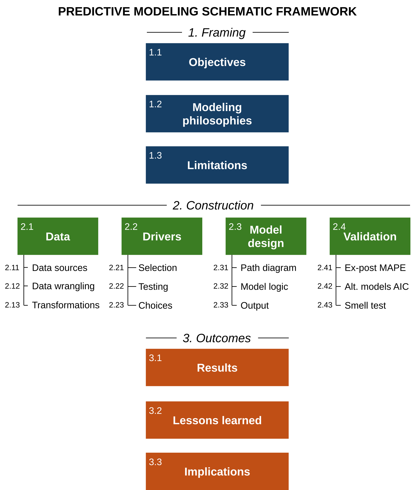

# Tellusant Predictive Model Evaluation Framework

*Work in progress. Graph is correct*  

Statistical model are often not contextualized in a structured manner and evaluating them becomes a laundry list of observations and questions. Here we suggest a structured approach based on the law of threes.

## Comments

The most important part of the modelling effort is to have the right higher-level cognitive choices laid out:  

**1.1 Objectives**  
gerg

**1.2 Modeling Philosophy**  
There are usefully seven modeling philosophies to choose among ranging from "let theory guide choices" to "if it works, it's OK".  

**1.3 Limitations**  
Any model has to make the [tradeoff between being predictive, explainable or understandable](horns-dilemma-2.md). All three cannot be achieved in one model. E.g., a pure timeseries model often works well for near-term forecasts but lacks explainability and transparency. A long-term non-linear regression model typically has high predictiveness and explainability, but may be hard to understand.  

These higher level choices are converted into specific modules:

**2.1 Data** 

**2.2 Drivers**

**2.3 Model Design**

**2.4 Validation**  

From this stem model outcomes:

**3.1 Results**

**3.2 Lessons Learned**

**3.3 Recommendations**
