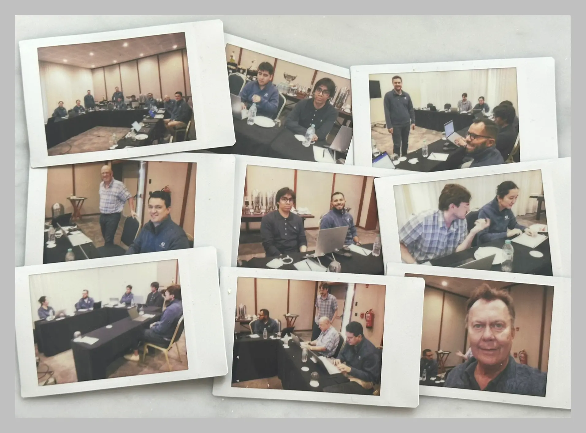

<video controls>
    <source src="(https://tellusant.com/repo/video/tellusant-global-retreat-punta-cana-2025-welcome-dinner.mp4)" type="video/mp4" width="600"; height="100%">

    <!-- Fallback text for browsers that do not support the video tag -->
    Your browser does not support the video tag.
</video>

## Team Building

We continue the Tellusant Global Retreat in Punta Cana. The second day was dedicated to team building at plantation and a cigar factory.

[p]

❶ Arriving at the plantation
❷ Making sure we are in the Dominican Republic
❸ Intensely viewing an animal
❹ Entering the cigar factory
❺ Making cigars under close supervision
❻ Taking a break from cigar making

Later, we went for a swim in the ocean and had a team dinner in the Italian restaurant on the resort.

## Workshop
The third day of the Tellusant Global Retreat in Punta Cana is dedicated to work sessions. The collage shows us in gloriously old tech 𝗙𝘂𝗷𝗶𝗳𝗶𝗹𝗺 𝗜𝗻𝘀𝘁𝗮𝘅 photos.  
 

 
Sessions were dedicated to training and internal planning.

• An overview session of our company and the way ahead
• A session on how to use our TelluBase data for strategic insights
• Brainstorming a business development plan based on lessons learned
• Several sessions on product development and data management

In the evening we had a team dinner at a spectacular French restaurant.

TEST OF GOOGLE VIEWER  
<iframe
  src="https://docs.google.com/gview?embedded=true&url=https%3A%2F%2Ftellusant.github.io%2Fdocs%2Fpresentations%2FS.Canback-Tellusant-Global-Retreat-Punta-Cana.pdf"
  style="width:100%; height:800px; border:0;"
  loading="lazy"
></iframe>
TEST OF BASIC VIEWER
<iframe
  src="https://tellusant.github.io/docs/presentations/S.Canback-Tellusant-Global-Retreat-Punta-Cana.pdf"
  width="100%"
  height="800"
  style="border:1px solid #ddd; border-radius: 12px;"
></iframe>
