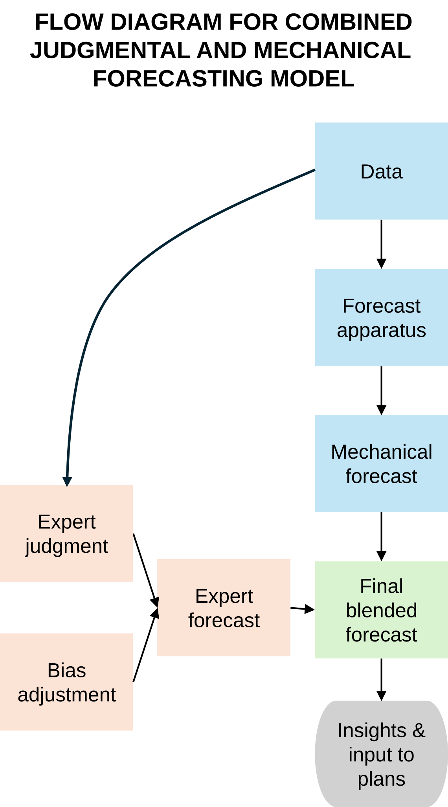

# Ratiocination of Tellusant's Judgmental-Mechanical Model

Here is an example of how our models are created for those interested in ratiocination (epistemic strategy): the process of exact thinking.

Several authorities have found that mechanical (statistical) forecasts benefit from adding expert judgment as an overlay. This what we allow in Polusim. There are two systems for how this is done:

1. Should the judgmental forecast be made independently of the mechanical forecast, and then merged?
2. Should the experts benefit from having the mechanical forecast as a base, and then form thir judgment?

We have chosen the second method. 

We started with a graph in an academic journal: Punia (2025):
 

This graph describes System 1 above. We therefore modified it conceptually to represent System 2.  

The graph looks reasonable, but is not. It lacks scientific rigor and is plain wrong. For example, a negative feedback loop should be added in a formally correct manner.

 
We therefore developed a scientific model aligned with time-discrete control theory. This is an example of a so-called P controller, the simplest and most fundamental of control theory constructs.

  
flowchart TD

%%{init: {'themeVariables': { 'fontFamily': 'Arial'}}}%%
%% ===== Inputs =====
D1["`**Demand (t−1)**`"]:::orange
X["`**Independent Variables** (Forecasted Externally / Exogenous)`"]:::orange

%% ===== Baseline model =====
M["`**Plant Model** (Statistical)`"]:::green
S["`**Statistical Forecast (t)**`"]:::green

%% ===== Judgment and correction =====
J["`**Judgmental Overlay**`"]:::green
Sum((Σ)):::base
K["`**Gain K**`"]
F["`**Final Forecast (t)**`"]:::green

%% ===== Realized demand =====
R["`**Realized Demand (t)**`"]:::orange

%% ===== Error and delay =====
E["`**Error e(t)** = Forecast(t) − Demand(t)`"]:::red
Delay["`**z⁻¹**`"]:::red

%% ===== Forward path =====
D1 --> M
X -->|⠀given⠀| M
M --> S
S --> J
J -->|"`⠀**+**⠀`"| Sum
Sum --> F

%% ===== Error computation =====
F --> E
R --> E

%% ===== Feedback =====
E --> Delay
Delay --> K
K -->|"`⠀**−**⠀ ⠀Neg. feedback loop⠀`"| Sum

%% ========= STYLES =========
classDef green   fill:#E8F5E9,stroke:#1B5E20,stroke-width:2px,color:#111;
classDef blue    fill:#E3F2FD,stroke:#0D47A1,stroke-width:2px,color:#111;
classDef orange  fill:#FFF8E1,stroke:#FF6F00,stroke-width:2px,color:#111;
classDef red     fill:#FDECEA,stroke:#B71C1C,stroke-width:2px,color:#111;
classDef grey    fill:#F5F5F5,stroke:#424242,stroke-width:2px,color:#111;
classDef base    fill:#ECECFF,stroke:#9370DB,stroke-width:2px,color:#111;

Definitions from control theory:  
**Plant** = A real-world process. The term is central to control theoty. A plant can be human hearing, a car brake, an AI prompt; anything that modifies an input.  
**Plant model** = An approximation of the plant. Here a statistical analysis.  
**z−1** = the time-shift operator, here 1 year, z−1(t) = t-1  
**Gain** = The sensitivity to past error (how strongly bias is corrected). Here a factor K, but can be an equation. K is often 1.

---
[See our collection of thought pieces on predictive model theory](predictive-modeling-collection.md)  

[Find more articles and posts](index.md)
