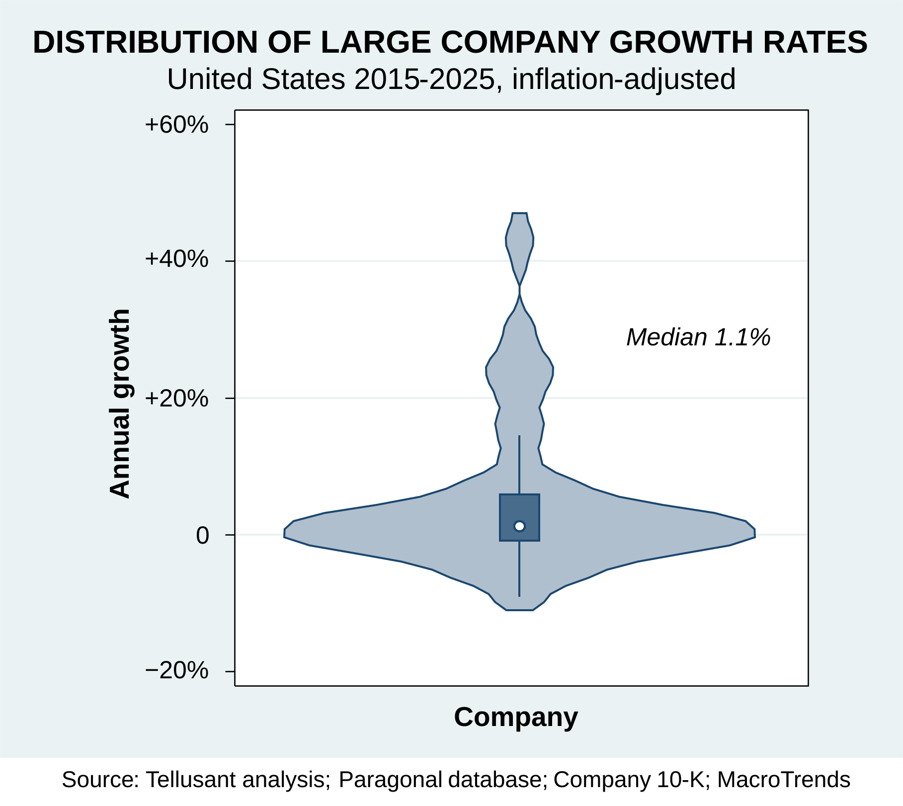
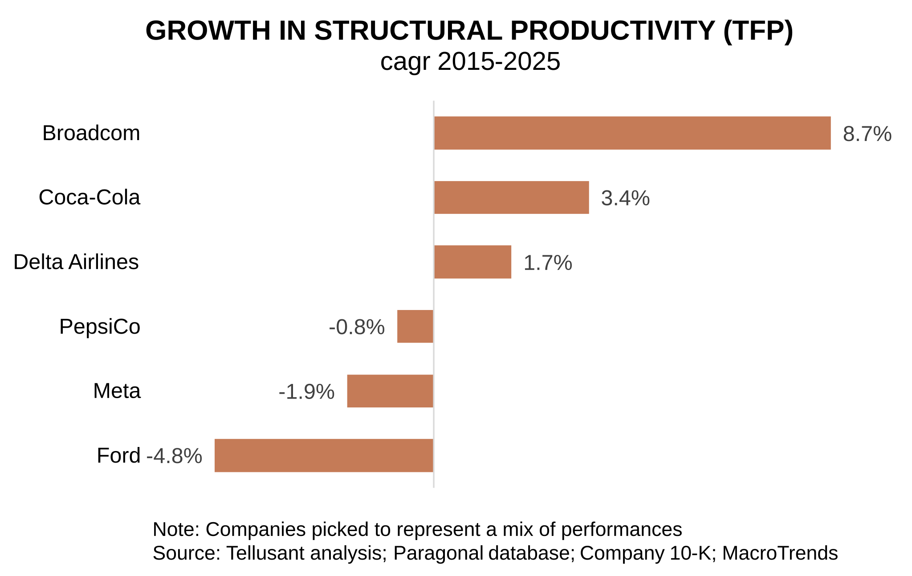
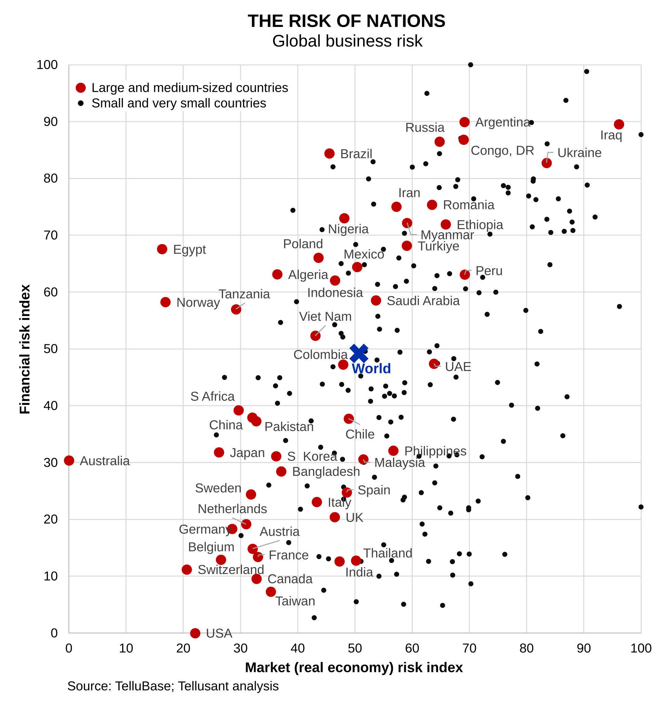
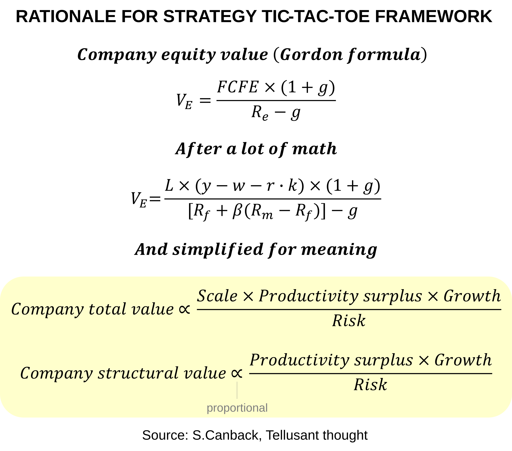

# The Strategy Grid: Decomposing Corporate Priorities Based on Growth, Productivity and Risk
_by Dr. Staffan Canback, Tellusant_  

>Strategic thinking is often muddled because there are too many concepts thrown around with an unclear understanding of what truly matter. Take Porter's Five Forces: an excellent framework, but what in the framework affects corporate performance and by how much? One can create ever-increasing detail without getting smarter.

Tellusant's **strategy grid** is rooted in economic theory that shows how value is a function of three quantifiable strategic levers: growth, productivity, and risk. All applied at country, company, and business unit levels. They directly link to the value of the company.

These are _**primitives**_. That is, foundational building blocks that cannot be subdivided, from which other states (such as profitability) are derived.

In a strategic tic-tac-toe, companies search for the best combination of the nine primitives in the strategy grid. This is a never-ending excercise since circumstances change forever.

Most companies are not aware of the importance of the primitives and only measure some of them. We know from our practical work that all nine can be quantified and automatically updated, and we already have seven up and running in our solutions.

## The Strategy Grid

The strategy grid emanates from the proof provided in the last section. It is a simple way to communicate what drives corporate value and all leadership teams should have the grid populated for easy access. This is not to say that this the entire strategy, only that it is the starting point.

### Macro
The horizontal axis starts with macro. Any CEO would say it is better to be in a growing country than a declining country.  

But they should also prefer countries with strong productivity growth. Yet few are aware this metric. Instead the focus is on, e.g., GDP growth in total instead of the quality of that growth.  

How should we think about productivity? There are three components working on GDP:
- Labor
- Capital
- Structural productivity ≡ total factor productivity (TFP) ≡  Solow residual  

Structural productivity is whether the country is *getting better*, in some sense. If labor and capital are growing at the pace of the country, it is said to be scaling. If structural productivity inproves beyond this, the country is said to be improving.

This is expressed in a Cobb-Douglas equation:  

$$GDP = A K^{\alpha} L^{1-\alpha}$$  
$$A = Structural \ productivity$$  
$${\alpha} = \ Share \ of \ capital \ in \ the \ economy$$  

Global average for ${\alpha}$ is ≈0.45 with large variations between countries.  

With some mathematical manipulation, we see that:  

$${\Delta} GDP = {\Delta}A + {\alpha}{\Delta}K + ({1-\alpha}){\Delta}L$$

Thus the change in GDP is a function of changes in structural productivity, capital, and labor.

In addition, country risk should be part of the perspective on country attractiveness. It often is, but sometimes with the wrong metrics. We suggest a volatility measure as the primitive.  

### Company
Then follows the company and its competitors. Growth is often reasonably well understood, but with low precision. In our experience all companies can improve on this metric.  

Productivity is poorly understood. It is usually done in a scattered manner through benchmarking. But this should not be the starting point. The starting point is the high level picture using similar methods as in country analysis: labor, capital, and structural productivity. These are well-known metrics, but rarely used.  

Risk at the company level should also focus on volatility (stock market beta is not part of the consideration though). Quarterly or monthly data makes it easy to measure volatility for the company, its competitors, and the market as a whole.  

### Business Unit
The logic for business units is the same as for the company as a whole, just scaled down. The comparisons are both against competiton and against other business units. The latter allows for a way to calibrate BU performance in a scientific way.

---
## Illustrations

To illustrate, here are three examples from the grid:

### Grid cell 12: Company Growth

Growth is a well-known metric at all companies. The violinplot below shows the inflation-adjusted grwoth for large U.S. companies.The median is 1.1% over the past decade which likely is less than the casual observer expect. However, since the sum of all companies' value-added is their contribution to GDP, the growth rate has to be in that neighborhood.

Note the high growth of some companies, led by Uber. These tropes are not the norm though.

### Grid cell 22: Company Productivity
Most companies are not aware of their productivity in a robust sense. Here we show a comparison of total factor productivity growth 2014-2024 for a few large companies. Total factor productivity contains all factors outside labor and capital productivity. It represents better management practices, innovations, new technology, and more. It is a crucial measure of a company's performance. If this is low, the company is just scaling labor and capital, not advancing its practices. If it negative, the company is regressing.

This bears repeating. Is the company just scaling, or is it advancing? In the example (with real data), Coca-Cola shows sharply advancing practices over time, PepsiCo is regressing.

### Grid cell 31: Country risk
Too much time is often spent looking at political risk. A better starting point is to understand the real economy risk and financial risk of a country. Below is an example for larger countries (with real data).

A qualitative risk assessment, available for most countries, is shown here: [South Africa's Economic Sentiment](https://tellusant.github.io/docs/articles-posts/economic-and-policy-sentiment-zaf.html). It is automatically generated with constricted AI support and automatically updated.

> We have earlier published the [EMIO strategy development framework](../papers/toward-an-integrated-strategy-development-framework.html). It is reasonable, but 1) has too much detail, and 2) does not take the full economic theory perspective — it lacks primitives. Thus, it cannot be the starting point for strategy development. It is nevertheless a wonderful resource for ideas.

> We hold a strictly quantitative perspective on strategy. In the long run, all strategy development will be quantitative and it is only a matter of when each company starts its transition. Some authorities, like Roger Martin, may disagree with this stance.  

## Proof of Strategy Grid
It is easy to come up with conceptual frameworks. It is what partners at leading consulting firms excel at. But are they right? Ususally not, and typically they are [not even wrong](https://en.wikipedia.org/wiki/Not_even_wrong). Outside consulting, Maslow's hierarchy of needs is an example of a framework that looks reasonable but has no evidence in science.

We therefore went back to fundamental economic theory to create a robust framework.

1. A company's value is the sum of future free cash flow at a certain growth rate, discounted back at a cost of capital that reflects risk.

2. Free cash flow is a function of profitable and a few other factors. However, neither cash flow nor profitability are primitives. They can be decomposed.

3. The proper way to decompose profitablity is by productivity (capital and labor) surplus.

4. We therefore have that company value depends on productivity surplus, growth, and risk.

The graph below shows a summary of the applied math behind this. _Company total value is the capitalized value of productivity surplus, scaled by size, growing at rate g, and discounted for systematic risk._ The structural value takes out the scale (.i.e., size) element to make companies comparable.

The full proof is published in _**Tellusant Quick Read: Proof of Firm Value Decomposition Based on Primitives**_.

As for the horizontal axis, the **primitives** are self evident. Macro is usually countries but can be subdivisions or cities. Business units can be by product / service or by geography, but not functional.

---
[Find more articles and posts](index.md)
