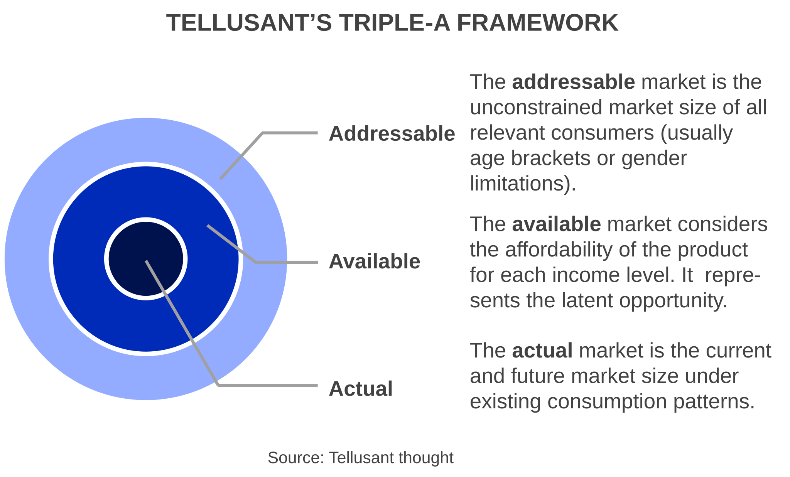
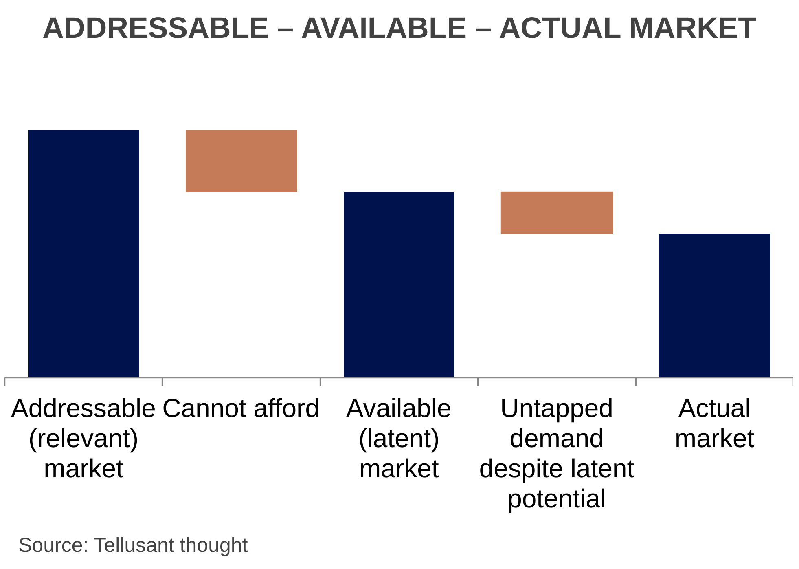
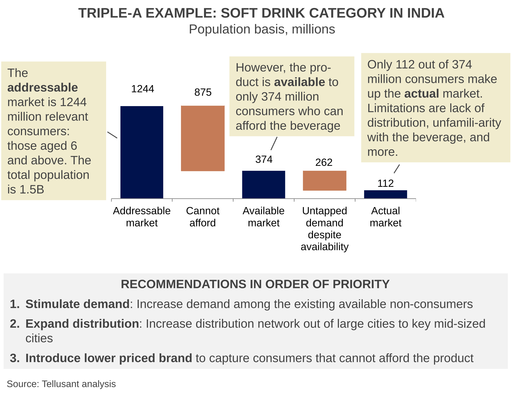

# The Triple-A Method for Market Sizing

Quantifying market opportunities requires clear definitions. The Addressable – Available – Actual market sizing method provides this. It is a logical way to understand not only current market size, but also the latent market.

  

The graph above illustrates the concept.
- The addressable market is the unconstrained market size if all relevant consumers had access to the product and were buying it. Relevant consumers are, e.g., parents of children age 0-4 for diapers; adults over the legal drinking age for alcoholic products, people living under wintry conditions for snow tires.
- The available market takes is the part of this market where people can afford the product. To understand this, it is necessary to know how many people have a certaion income, and their age distribution. Companies do not have this information, but it can easily be retieved from telluBase.
- The actual market is what people truly consume. This is what companies typically look at without knowing what the latent potentisl is. We recommend understanding the Addressable-Available-Actual metrics before making plans for the actual market. Perhaps the actual market can be expanded significantly if certaion actions are taken to unlock it?

With the Triple-A method, it is possible to pinpoint where the growth opportunities lie. The graph below shows a schematic waterfall for the logic.

  

Here is an example from soft drinks in India. The product is currently only distributed in big cities.

- Out of a total population of 1.3 billion, 369 million are within those socioeconomic levels that can afford the product. This is the addressable market of relevant consumers.

- However, there is no distribution coverage in the foreseeable future for 256 million of those consumers since distribution only exists in the largest cities.
- Thus, the available market is 113 million consumers. This may change over time, but over the next 5 years there is no such change in site.
- Among those consumers, 105 million chose not to consume the product despite it being widely available.
- Thus, the actual market is 8 million consumers.

  

The largest leverage is in selling more in those cities. Why? If the company chose to pursue maximum distribution, then it would sell to 26 million consumers (all other things equal). That is, 369/113*8=26.

This should be compared to the recommended first step of stimulating demand among the existing available consumers. There are 105 non-consumers and only 18 million of them have to be converted into consumers to match the maximum distribution scenario above (8+18=26). The cost to serve these new consumers is radically lower than building maximum distribution coverage all over India.

To succeed in these large cities, further analyses showed that it was necessary to change pack sizes, do more effective marketing in the cold season, and adjust price points.

The benefit of Triple-A is that it creates a logical framework for great discussions within management teams.

