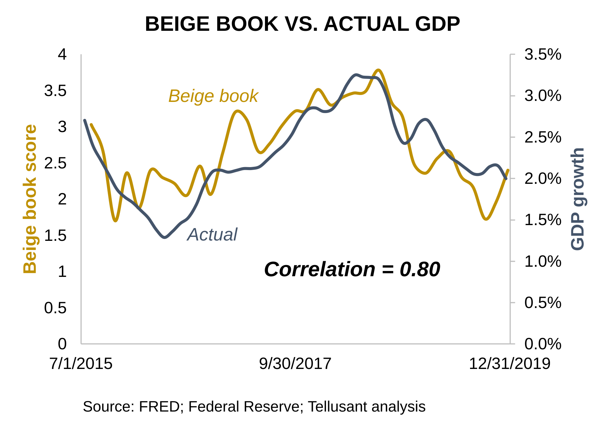

# Comparison of Fed Beige Book Score and Actual GDP Growth

As you look at our Beige Book summaries, you may ask: "does the Beige Book score correlate with actual GDP growth (reported a few months later)?"

It does. The correlation is a remarkably high 0.80. This means that we know what the current situation is well ahead of GDP reporting.

