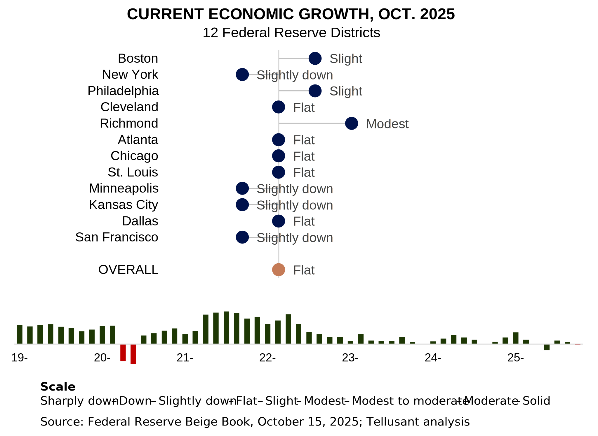

# Federal Reserve Beige Book Analysis
The Beige Book covers current economic activity. It is published sesqui-monthly (every 1 1/2 month). It gives a qualitative snapshot of what is currently happening in each of the 12 Federal Reserve Districts. It is thus a nowcast.

The Beige Book is useful for, among others, CEOs and management teams who want to quickly assess where the economy is presently.

We compute a composite score for each of the 12 districts based on the wording in the report, then sum the scores weighted by the GDP of each district.

A retrospective comparison between our Beige Book metric and actual GDP growth is found here: [Comparative Analysis](https://www.linkedin.com/posts/scanback_economy-gdp-usa-activity-6623665605125955584-24lF/).  

---
## October 2025

The October 2025 report shows significant weakness. It ranks 80th of the 83 periods we have analyzed since beginning of 2016. Dscounting two covid periods, it is the second worst in our dataset (June 2026 being the worst).

Only three district show economic expansion:
- Richmond
- Boston
- Philadelphia  

Three show contraction:
- Kansas city
- Minneapolis
- San Francisco  

Six are flat.

Tariffs and erratic government policies are  likely causes of the poor performance.

---
