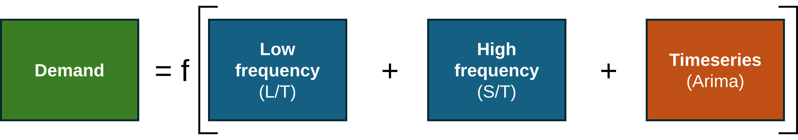
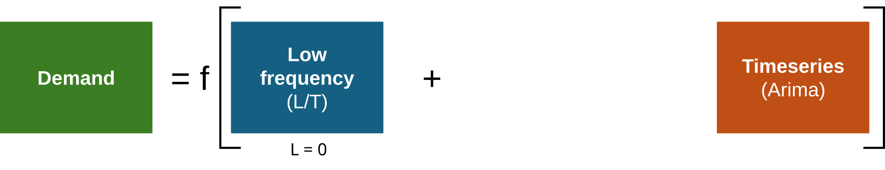
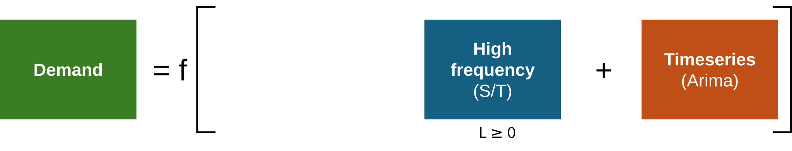
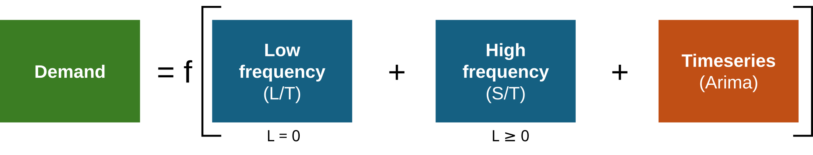
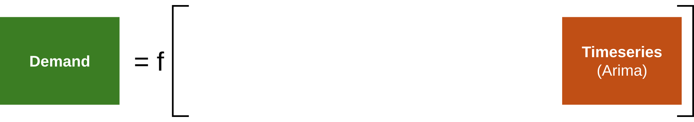

# The General and Special Models for Demand Forecasting

These are the equations that should be starting point for any forecating effort. The general model is rarely used. Instead pick one of the special models.

## General Model

Schematically, the general model looks like this:

This is the equation for a "raw" regression:

$$(1) \quad \Delta y_t= \alpha+ \sum_{k \in \mathcal{LF}} \beta_k(L)\,\Delta x_{k,t}+ \sum_{j \in \mathcal{HF}} \gamma_j(L)\,\Delta w_{j,t}+ u_t,\quad u_t \sim \text{ARIMA(p,d,q)}$$

We often prefer to run a de-trended, stationary model in differences which has a slight modification in the timeseries part:

$$(2) \quad \Delta y_t= \alpha+ \sum_{k \in \mathcal{LF}} \beta_k(L)\,\Delta x_{k,t}+ \sum_{j \in \mathcal{HF}} \gamma_j(L)\,w_{j,t}+ u_t,\quad u_t \sim \text{ARMA(p,q)}$$

*(L)* means that a lag term may be included. *LF* = Low frequency (long-term influences on demand) such as population growth; *HF* = High frequency (short-term influences on demand) such as unemployment. Price often shows up as both *LF* and *HF*  with *HF* usually more important.

Note the subtle variations: *(1)* has *Δw* while (2) has *w* since it is already differenced. *(1)* has *ARIMA(p,d,q)* while (2) has *ARMA(p,q)* since *d* disappears when differencing. 

Note that *LF* or *HF* coefficients may be calculated in a separate model and elasticities then set as static.

These are ARIMAX equations, but with a clear distinction between long-term and short-term independent variables and the timeseries component.

## Special Models

### A. Long-term regression without lag effects and timeseries component
This is useful for strategic forecasting and cross-sectional analyses. Works with pooling.

### B. Long-term regression with timeseries component
This is useful for strategic forecasting with a timeseries component. It cannot be pooled.

### C. Short-term regression with timeseries component
This is a typical ARIMAX or ARMAX case for operational forecasting.

### D. Short-term regression with long-term drivers inpact and with timeseries component
This is the most complex model. Seldom used, but important. It allows for combination of short-term and long-term demand drivers. The long-term drivers are usually estimated with A. or B. above, and then "grafted" on as predetermined static coefficients. Also for operational forecasting.

### e. Ultra-short-term regression with only timeseries component
For tactical forecasting less than 4 weeks out.

Once one of these basic equations has been modelled and understood, more complex models may be pursued. These include 
