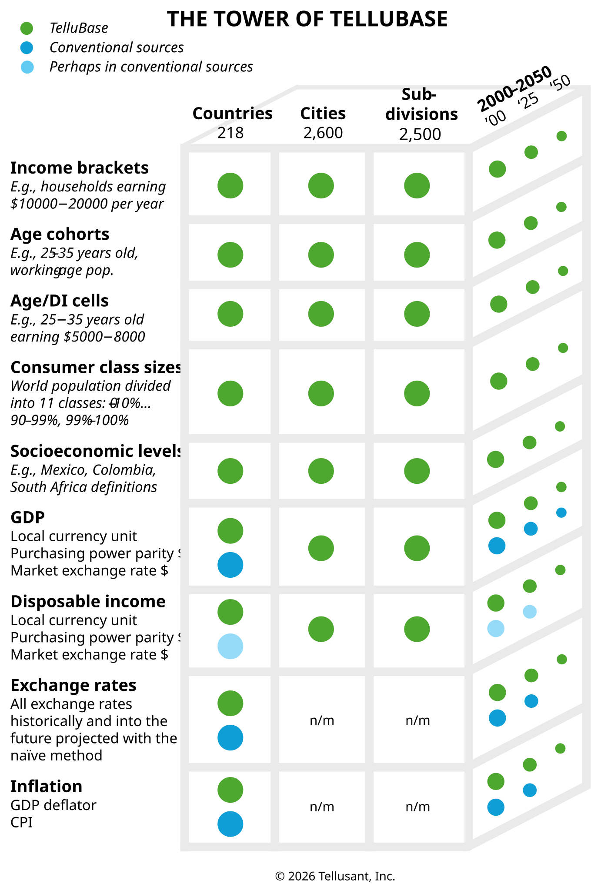

# The Tower of TelluBase

<a href="{{ site.company_url }}" style="color: black; text-decoration: none;"><i>By Tellusant, Inc.</i>

## *TelluBase Definitions*
[To access TelluBase and purchase data, visit the website](https://tellubase.com).

We show the contents of TelluBase in a simple 3D "tower", demonstrating its comprehensiveness. It makes clear what is unique about TelluBase compared to conventional data sources.

The _Tower of TelluBase_ has three dimensions: Data series, geographies, and years.

<figure>

</figure>

You will see that everything referring to distributional economics is completely unique to TelluBase. In strategy parlance, it is VRIO:
- **Valuable**. Demand for any product or category is 80-90% determined by hoesehold income distribution. TelluBase has this.
- **Rare**. No other company provides these data on a global basis.
- **Inimitable**. SInce the start in 2007, no one has been able to create a global product of TelluBase's magnitude and scope.
- **Organized**. We manage the database in a highly structured manner so that we do not are overly dependent on key personnel.

Commercial data sources tend to report back data they scrape from government and other sources without any value added except ease of access. TelluBase, in contrast, is a *managed* information resource.

## Table of TelluBase
Here is the Tower in table form for easy read by crawlers.

|Data type|Data series|Descriptor|Source|Country|City|Subdivision|Past 2000-|Current|Future -2050|
|-|-|-|-|-|-|-|-|-|-|
|Distributional|Income brackets|E.g., households earning $10000−20000 per year|TelluBase|Yes|Yes|Yes|Yes|Yes|Yes|
|Distributional|Income brackets|E.g., households earning $10000−20000 per year|Conventional data providers|No|No|No|No|No|No|
|Distributional|Age cohorts|E.g., 25–35 years old, working-age pop.|TelluBase|Yes|Yes|Yes|Yes|Yes|Yes|
|Distributional|Age cohorts|E.g., 25–35 years old, working-age pop.|Conventional data providers|No|No|No|No|No|No|
|Distributional|Age/Income cells|E.g., 25−35 years old earning $5000−8000|TelluBase|Yes|Yes|Yes|Yes|Yes|Yes|
|Distributional|Age/Income cells|E.g., 25−35 years old earning $5000−8000|Conventional data providers|No|No|No|No|No|No|
|Distributional|Consumer class sizes|World population divided into 11 classes: 0–10%…90–99%, 99%–100%|TelluBase|Yes|Yes|Yes|Yes|Yes|Yes|
|Distributional|Consumer class sizes|World population divided into 11 classes: 0–10%…90–99%, 99%–100%|Conventional data providers|No|No|No|No|No|No|
|Distributional|Socioeconomic levels sizes|E.g., Mexico, Colombia, South Africa definitions|TelluBase|Yes|Yes|Yes|Yes|Yes|Yes|
|Distributional|Socioeconomic levels sizes|E.g., Mexico, Colombia, South Africa definitions|Conventional data providers|No|No|No|No|No|No|
|Aggregate|GDP|Local currency unit; purchasing power parity &dollar;; market exchange rate \$|TelluBase|Yes|Yes|Yes|Yes|Yes|Yes|
|Aggregate|GDP|Local currency unit; purchasing power parity \$; market exchange rate \$|Conventional data providers|Yes|Yes|Some|Yes|Yes|Some|
|Aggregate|Disposable income|Local currency unit; purchasing power parity dollar; market exchange rate dollar|TelluBase|Yes|Yes|Yes|Yes|Yes|Yes|
|Aggregate|Disposable income|Local currency unit; purchasing power parity \$; market exchange rate \$|Conventional data providers|Yes|Yes|Some|Yes|Yes|Some|
|Aggregate|Exchange rates|All exchange rates historically and into the future projected with RER|TelluBase|Yes|n.m.|n.m.|Yes|Yes|Yes|
|Aggregate|Exchange rates|All exchange rates historically and into the future projected with RER|Conventional data providers|Yes|n.m.|n.m.|Yes|Yes|No|
|Aggregate|Inflation|GDP deflator; CPI|TelluBase|Yes|n.m.|n.m.|Yes|Yes|Yes|
|Aggregate|Inflation|GDP deflator; CPI|Conventional data providers|Yes|n.m.|n.m.|Yes|Yes|No|

