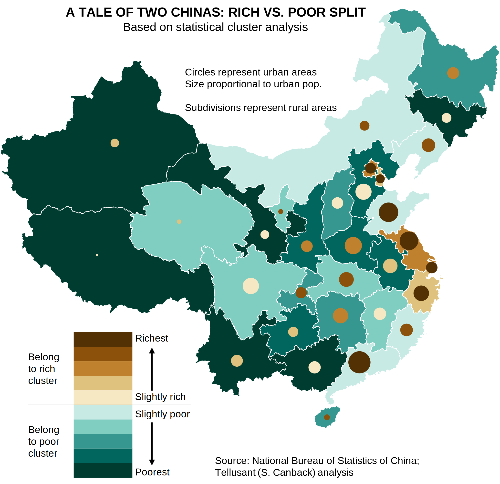

# The Tale of Two Chinas—The Rich vs Poor Split
The income per capita disparity between urban and rural areas is large in China. We used our TelluBase data to create this map showing the clear divide.

---
#### 
---
