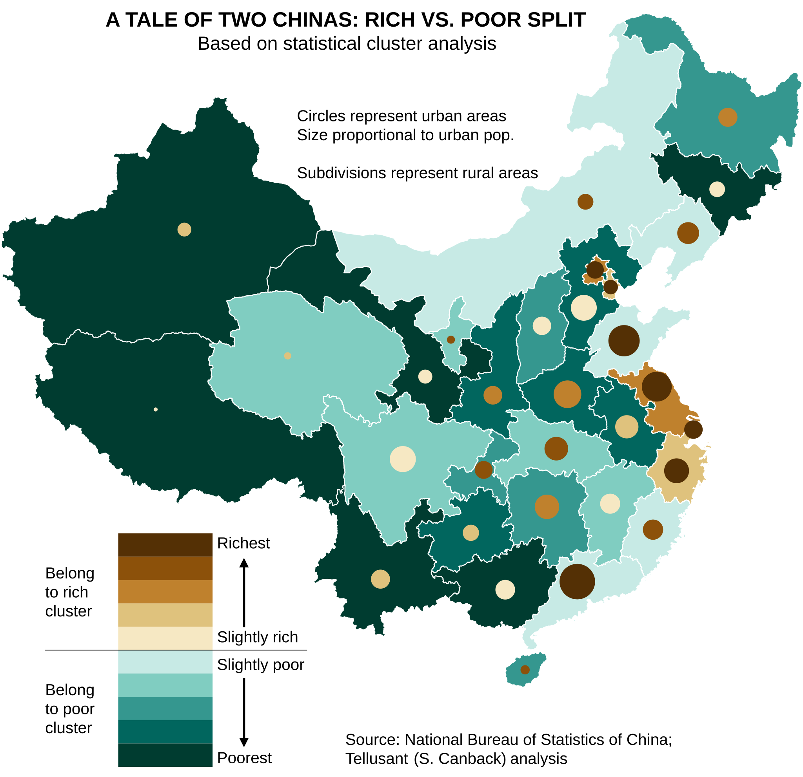

# A Tale of Two Chinas—The Rich vs Poor Divide

<a href="{{ site.company_url }}" style="color: black; text-decoration: none;"><i>By Tellusant, Inc.</i>

The income per capita disparity between urban and rural areas is large in China. We used our TelluBase data to create this map showing the clear divide.

[To learn about TelluBase and to purchase data, visit the website](https://tellubase.com).

---
#### 

---
---
[Find more maps](index.md)  

*Source: Tellusant, Inc.*  

[2021-10-02]
