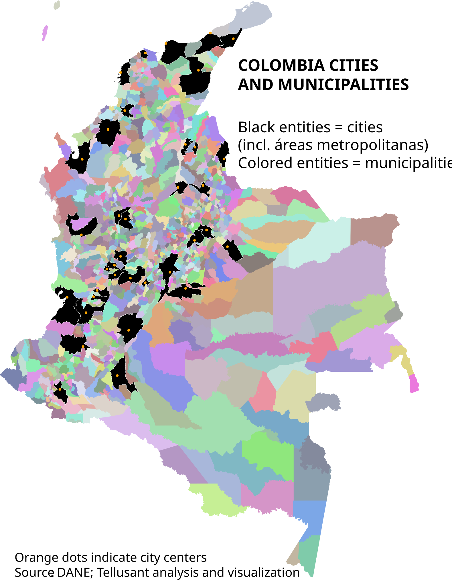

# Colombia – Cities and Subdivisions Covered in TelluBase
## *TelluBase Definitions*

The map shows the 36 large cities and 1100 secondary subdivisions in Colombia.  

For each of these entities, we cover economic, socioeconomic, and demographic information, as well as the size of the consumer classes. All this with a view toward the future with data covering 2000 till 2050.  

[To learn about TelluBase and purchase data, visit the website](https://tellubase.com).

---
####   

---
[Find more maps](index.md)  

*Source: Tellusant, Inc.*  
