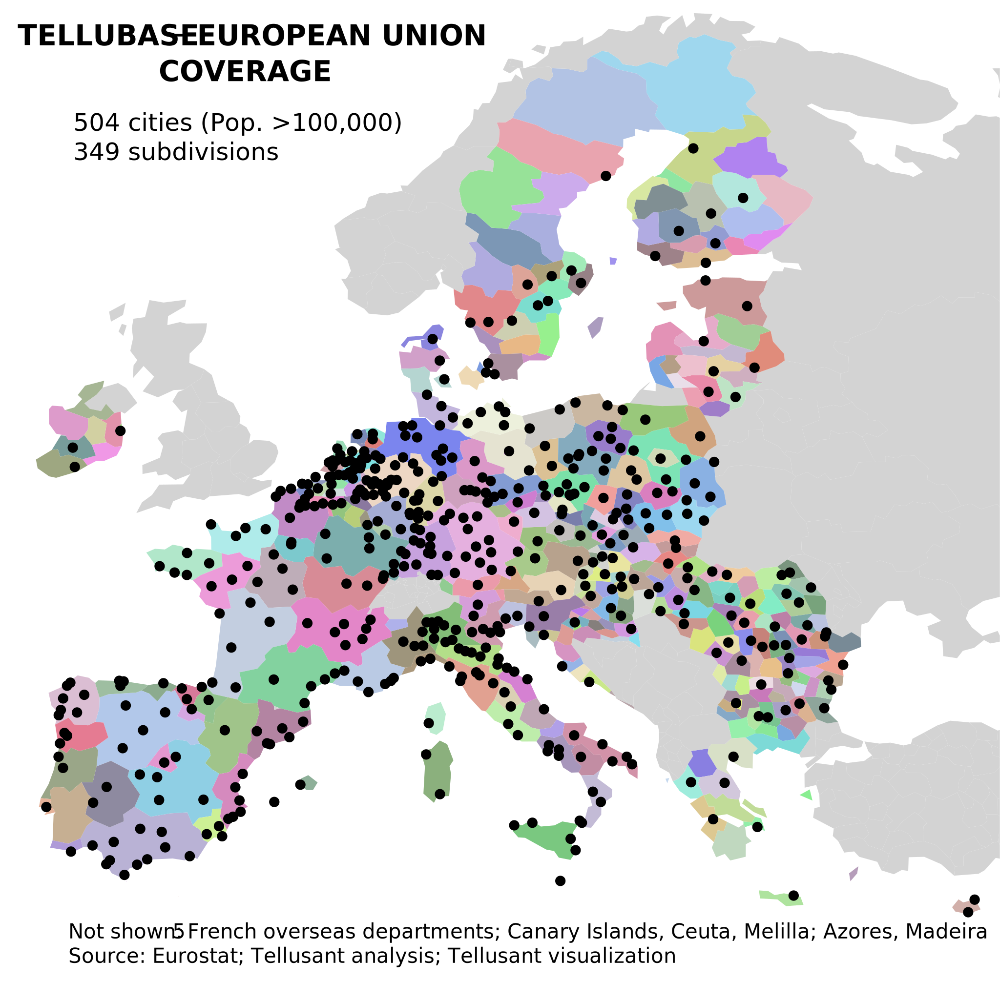

# European Union Cities and Subdivisions Covered in TelluBase
## *Uses of TelluBase* Series

Countries typically paint too coarse a picture for the EU. A more suitable way to understand the European economy is to look at cities and NUTS socioeconomic regions.

We cover 504 cities and 349 subdivisions. They are NUTS 0, 1, 2, or 3 depending what representants a country best.

---
#### 

---
