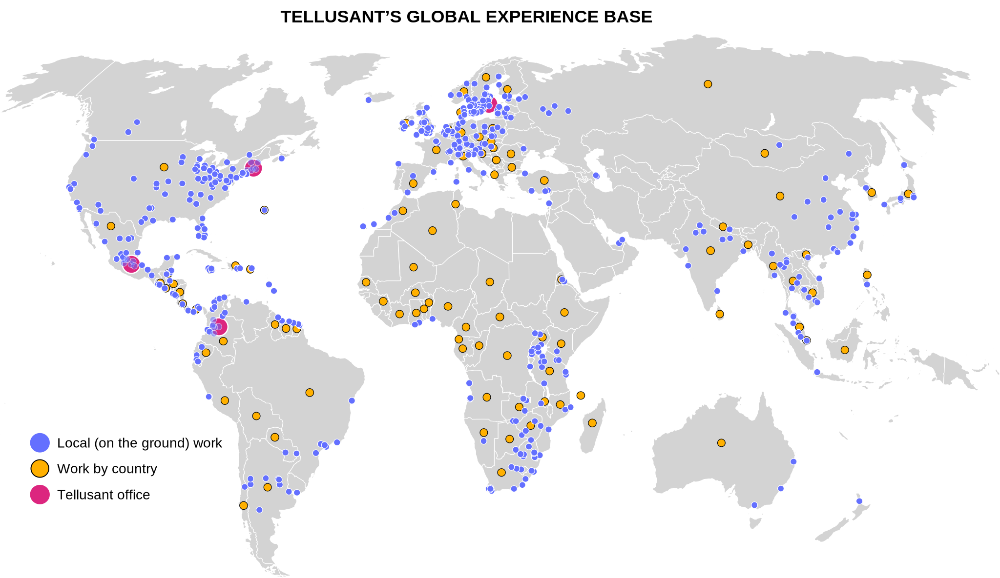

# Tellusant Global Experience Base  
The map shows the how deep Tellusant leaders' global knowledge is. We have worked on the ground in 92 countries, usually far from away from the capitals and country headquarters of our clients. Thus, we understand city, other urban, and rural opportunities across the globe.

This serves us well when we calibrate our products to client needs. We know what realistic elasticities look like, we know what the limits in growth come from, and more.

While our products are analyticsl, our experiences are personal and human.

---
#### 

---
