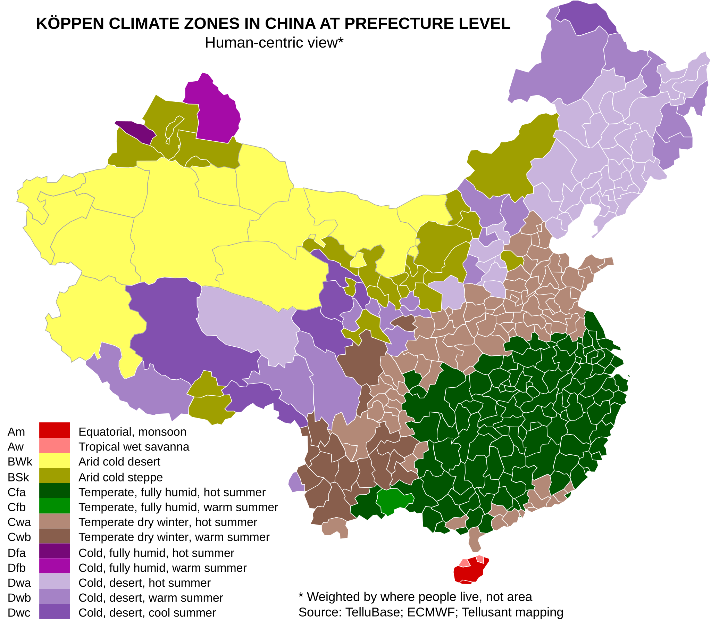

# China by Köppen Climate Zones

<a href="{{ site.company_url }}" style="color: black; text-decoration: none;"><i>By Tellusant, Inc.</i>

## *Uses of TelluBase* Series

China as a whole covers many climate zones. Here we show them at the secondary subdivision level (prefecture or equivalent).

This variability leads to differing consumer preferences and cultures around the country. Most famous is the wheat / rice divide.

[To learn about TelluBase and to purchase data, visit the website](https://tellubase.com).

---

#### 

---
[Find more maps](index.md)  

*Source: Tellusant, Inc.*  
