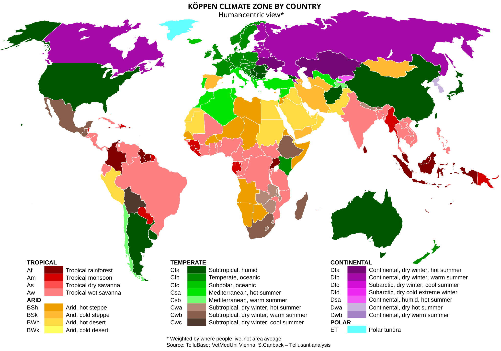

# The World by Köppen Climate Zones

<a href="{{ site.company_url }}" style="color: black; text-decoration: none;"><i>By Tellusant, Inc.</i>

## *Uses of TelluBase* Series

The map shows the population-weighted climate zones by country. That is, the climate where people live, rather than geographic area climate (e.g., Algeria has Mediterranean, not desert climate).  

Note: Only a handful of countries have diffuse climate zones (notably U.S., China) where there is no truly dominant climate.  

---
#### 

---
[Find more maps](index.md)  

*Source: Tellusant, Inc.*  
