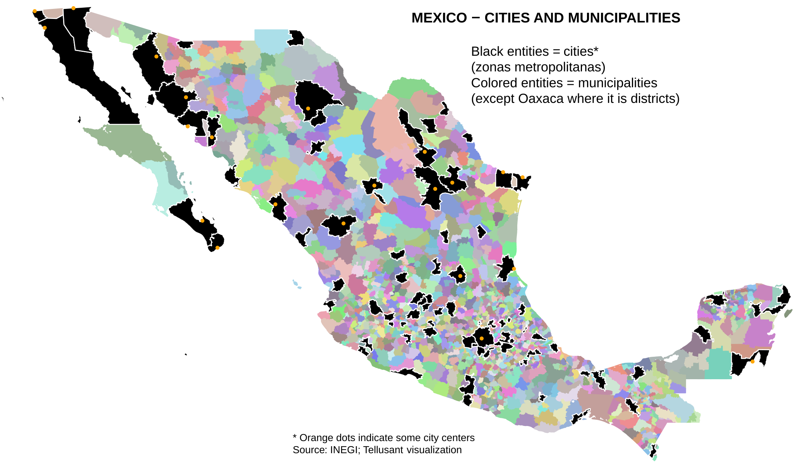

# Mexico – Cities and Subdivisions Covered in TelluBase

<a href="{{ site.company_url }}" style="color: black; text-decoration: none;"><i>By Tellusant, Inc.</i>

## *TelluBase Definitions*
The map shows the cities (92 zonas metropolitanas) and secondary subdivisions (1500 municipios) in Mexico.  

For each of these entities, we cover economic, socioeconomic, and demographic information, as well as the size of the consumer classes. All this with a view toward the future with data covering 2000 till 2050.  

[To learn about TelluBase and to purchase data, visit the website](https://tellubase.com).

---
## 

---
[Find more maps](index.md)  

*Source: Tellusant, Inc.*  
