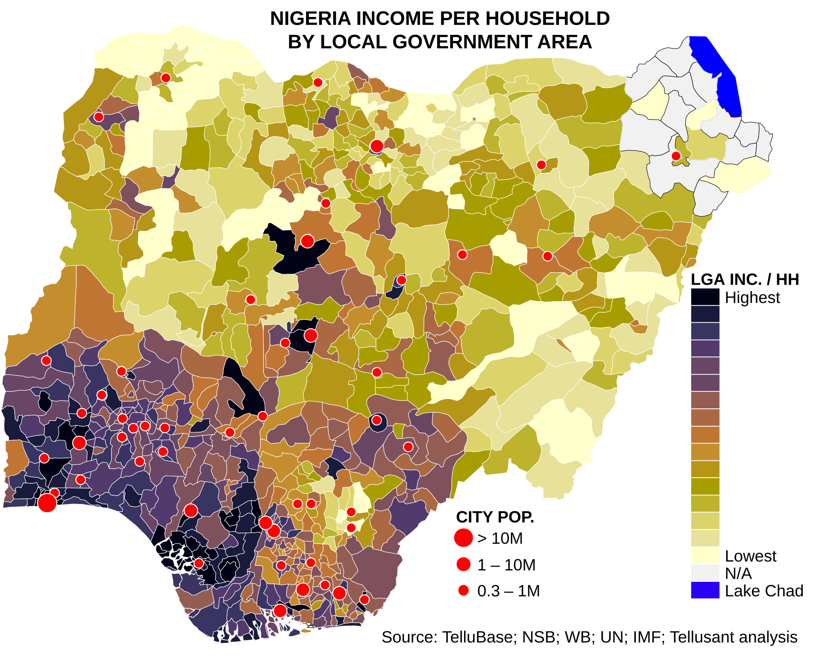

# Nigeria – Income per Household by Local Government Area

<a href="{{ site.company_url }}" style="color: black; text-decoration: none;"><i>By Tellusant, Inc.</i>

## *Uses of TelluBase* Series

Local Government Areas (LGA) are the secondary subdivisions (below states) in Nigeria. This map shows the income per household for the close to 800 LGAs and the 50 cities with a population larger than 300,000.

Our **TelluBase** database covers these secondary subdivisions and cities within its Nigeria module.

[To learn about TelluBase and to purchase data, visit the website](https://tellubase.com).

#### 

---
[Find more maps](index.md)  

*Source: Tellusant, Inc.*  
