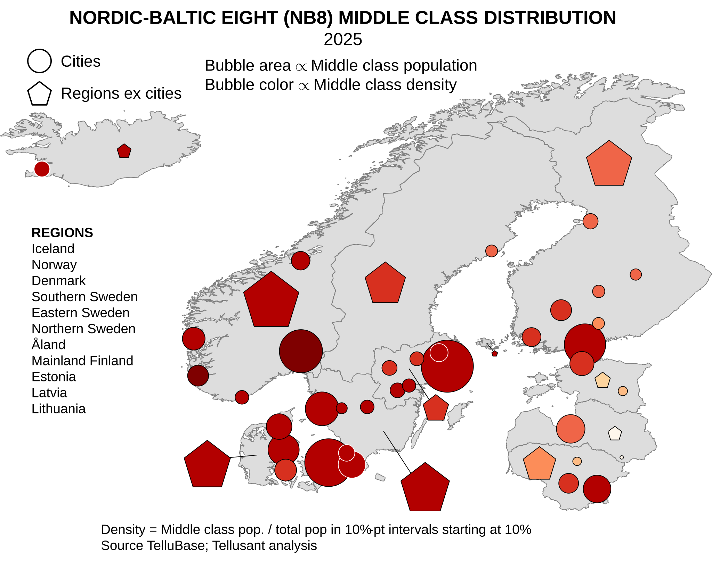

# Nordic-Baltic Eight (NB8) Middle Class Distribution in 2025

<a href="{{ site.company_url }}" style="color: black; text-decoration: none;"><i>By Tellusant, Inc.</i>

## *Uses of TelluBase* Series  

The map shows income levels at the city and primary subdivision levels for the emerging NB8 region.  

[To learn about TelluBase and to purchase data, visit the website](https://tellubase.com).

---
#### 

---
[Find more maps](index.md)  

*Source: Tellusant, Inc.*  
