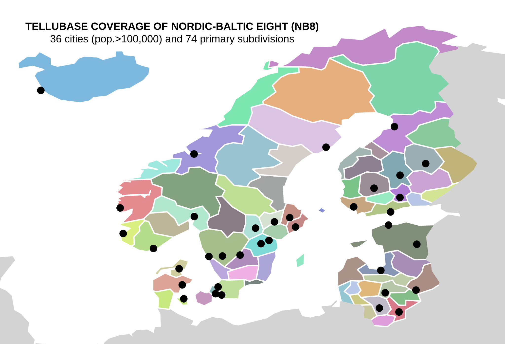

# TelluBase Coverage of the Nordic-Baltic Eight Region (NB8)
## *TelluBase Definitions*

The map shows the 31 cities with more than 100,000 inhabitants and the 74 primary subdivisions in NB8.

[To learn about TelluBase and to purchase data, visit the website](https://tellubase.com).

### 

---
[Find more maps](index.md)  

*Source: Tellusant, Inc.*  
