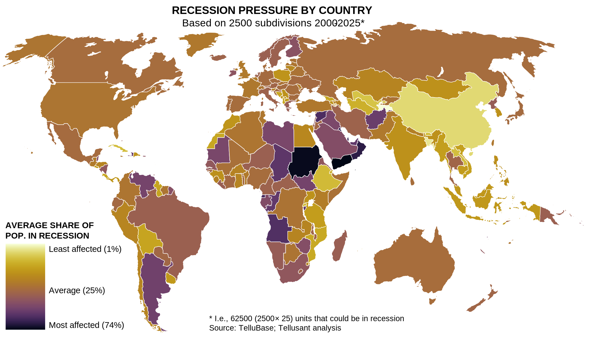

# Recession Pressure by Country
## *Uses of TelluBase* Series

What is the probability of a recession in a given country? We abnalyzed data for all (218) countries at the subnational level to find out. The map shows the the results.  

**Tajikistan** has the lowest recession probability, **Yemen** the highest. Most of the affluent counties have higher than average probabilities; emerging countries do better, with some notable exceptions.

---
#### 

---

