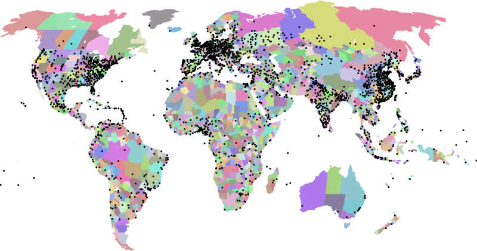

# TelluBase Global Coverage

<a href="{{ site.company_url }}" style="color: black; text-decoration: none;"><i>By Tellusant, Inc.</i>

## *TelluBase Definitions*
This map shows the 218 countries, 2600 cities, and 2500 primary subdivisions we cover in Tellubase. Beyond this, we cover 25000 secondary subdivisions.  

[To learn about TelluBase and to purchase data, visit the website](https://tellubase.com).

---
#### 

---
[Find more maps](index.md)  

*Source: Tellusant, Inc.*  
