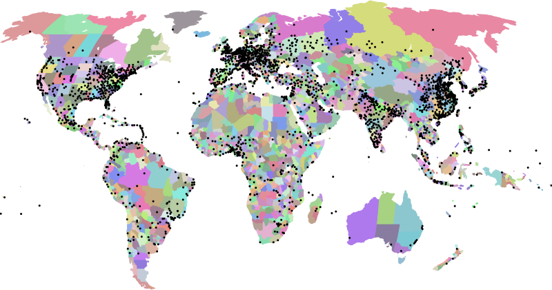

# TelluBase Global Coverage
## *TelluBase Definitions*
This map shows the 218 countries, 2600 cities, and 2500 primary subdivisions we cover in Tellubase. Beyond this, we cover 25000 secondary subdivisions.

---
#### 

---
