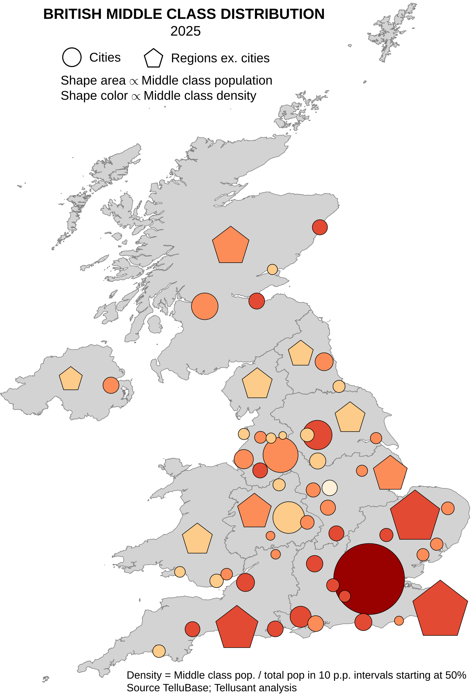

# British Middle Class Distribution in 2025

<a href="{{ site.company_url }}" style="color: black; text-decoration: none;"><i>By Tellusant, Inc.</i>

## *Uses of TelluBase* Series

See how British cities and subdivisions vary in size and density of the middle class.

[To learn about TelluBase and to purchase data, visit the website](https://tellubase.com).

---

---
[Find more maps](index.md)  

*Source: Tellusant, Inc.*  
