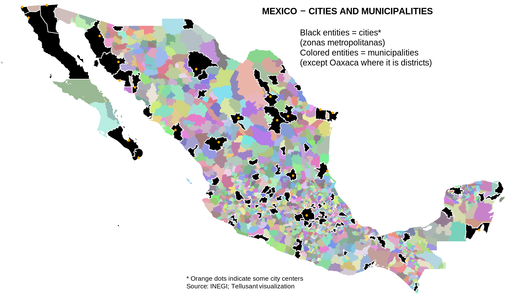

# Mexico – Cities and Secondary Subdivisions Covered in TelluBase
## *Uses of TelluBase* Series

The map shows the cities (92 zonas metropolitanas) and secondary subdivisions (1500 municipios) in Mexico.

For each of these entities, we cover economic, socioeconomic, and demographic information, as well as the size of the consumer classes. All this with a view toward the future with data covering 2000 till 2050.

---
#### 

---
