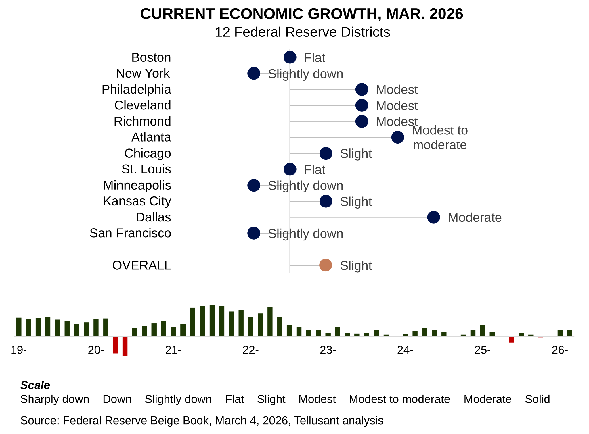
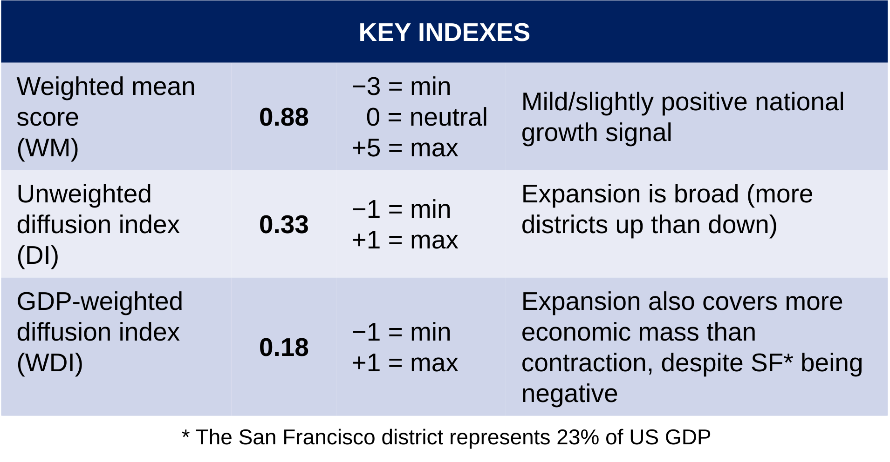
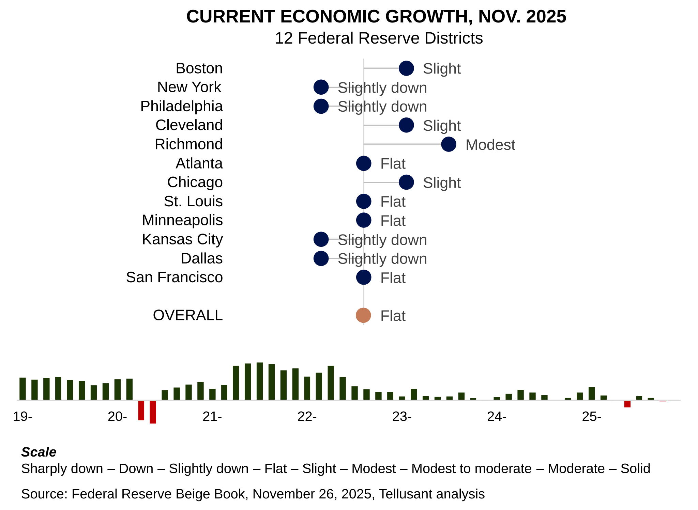

# Beige Book Nowcast Archive

---
## March 2026
> After more than a decade of publishing this periodical, we decided to test our logic with ChatGPT. Its evaluation:   
> *"Your methodology is actually quite good. Your method has several strengths:*
> - *Signal is extremely stable*  
> - *The Fed has used the same wording patterns for ~30 years*  
> - *High interpretability*  
> - *Unlike sentiment models, you can always point to the exact phrase*  
> - *Low model drift*
>   
> *Because vocabulary is controlled, your historical series remains consistent. This is rare in text-based economic indicators."*
>
> It then suggested adding the indexes you see in the table at the bottom.

The March 2026 report shows only slight growth. Performance is diverging significantly with some districts doing well, others doing poorly. This divergence is larger than usual.  

Three districts doing relatively well:  
- Dallas  
- Atlanta  
- Cleveland  
- Philadelphia  
- Richmond  

Poor performers are:  
- Chicago  
- Minneapolis  
- New York  
- San Francisco  

The rest are flat or show slight growth.  

The key resulting national indexes are reported below:  

Erratic government policies continue to damp growth. The Iran war is not reflected in the Beige Book yet.  
 

---
## January 2026

The January 2026 report shows improved economic economic conditions, but still only slight growth.

Three districts show reasonable (modest) growth:
- Richmond
- St. Louis
- San Francisco

Only one shows contraction:
- New York  

The rest are flat or show slight growth.

Erratic government policies continue to damp growth.  
 

---
## November 2025

The November 2025 report continues to show significant weakness for the sixth period in a row. It ranks 77th of the 84 periods we have analyzed since beginning of 2016. Discounting covid, June 2025 is the worst).

Only three district show economic expansion:
- Richmond
- Boston
- Chicago
- Cleveland  

Three show contraction:
- Dallas
- Kansas City
- New York
- Philapelphia  

Four are flat.

Dallas is particularly concerning since the district has done well, or very well, for 5 straight years (40 periods).  

Tariffs and erratic government policies are likely causes of the poor performance.  
 

---
## October 2025

  

The October 2025 report shows significant weakness. It ranks 80th of the 83 periods we have analyzed since beginning of 2016. Discounting two covid periods, it is the second worst in our dataset (June 2025 being the worst).

Only three district show economic expansion:
- Richmond
- Boston
- Philadelphia  

Three show contraction:
- Kansas city
- Minneapolis
- San Francisco  

Six are flat.

Tariffs and erratic government policies are  likely causes of the poor performance.  
 

---

Five years of our Beige Book nowcasts are available on LinkedIn.

Back to [current period](./beige-book.md)
