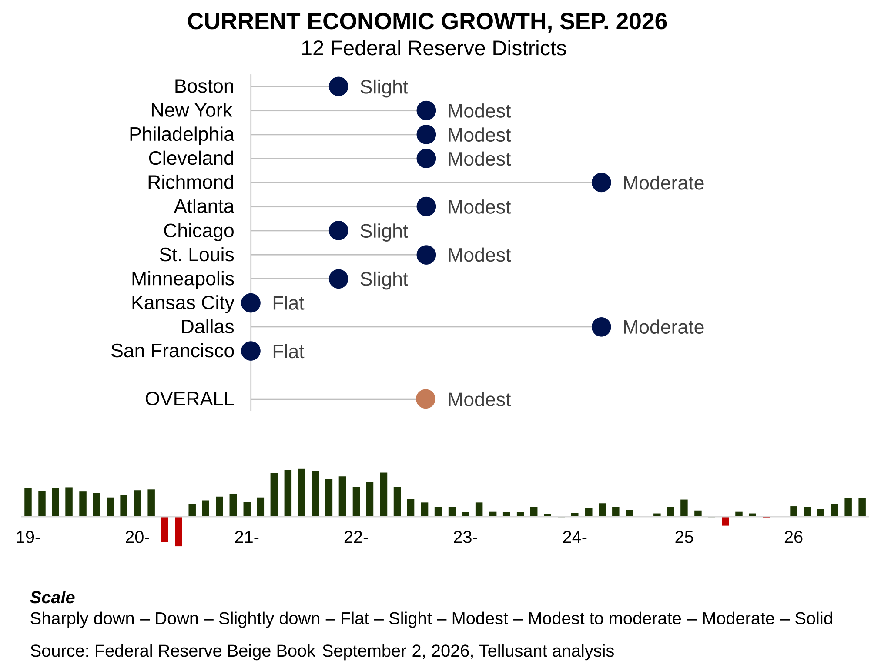
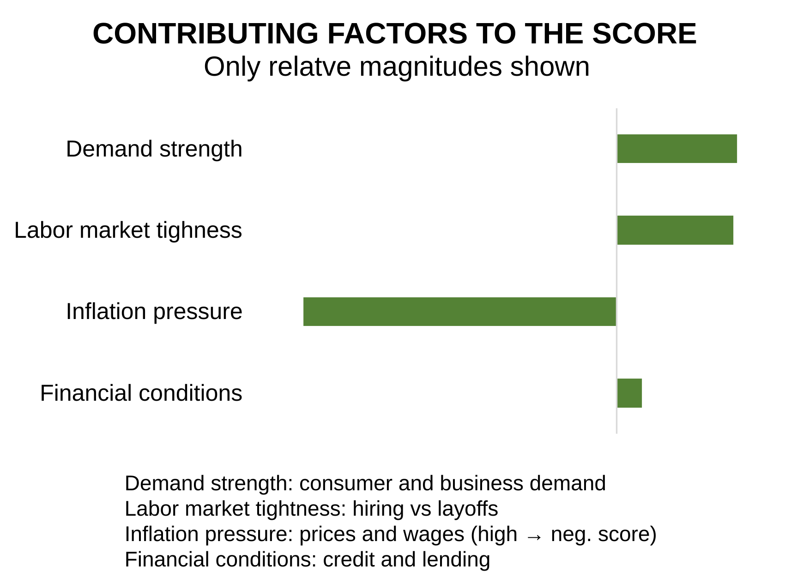
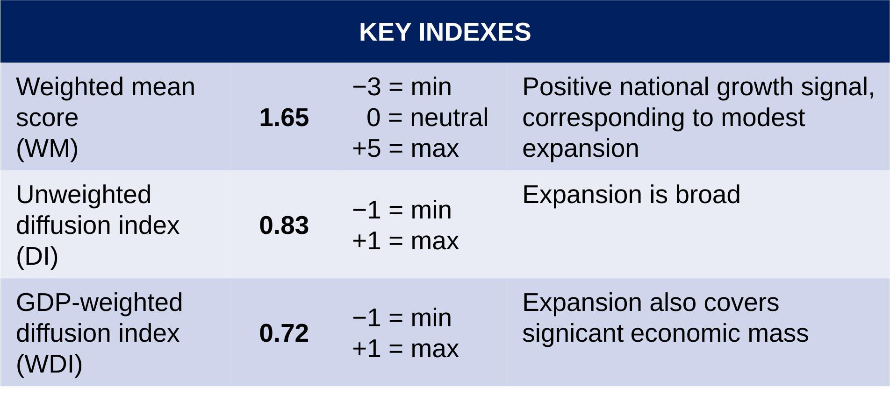

<a href="background.html">Find the background to Tellusant's Beige Book nowcast here</a>

# Beige Book Nowcast: Sentiment Analysis of Economic Activity — September 2, 2026

U.S. Economic activity increased modestly in the September Beige Book, with conditions improving across 11 of 12 districts. National performance was slightly lower than in the June Beige Book. 

 

Underlying conditions point to continued support from demand and labor markets, though persistent price pressures remain a constraint on overall economic momentum.

The GDP-weighted growth index is 1.71, up from 1.16 in June, which indicates a modest growth rate, up from slight. Both unweighted and weighted diffusion measures rose, suggesting that activity is becoming more evenly spread across ditricts. 

---
#### [Archive](archive.md)

#### [Retrospective Comparison of Fed Beige Book Nowcast and Actual GDP Growth](retrospective.md)  
