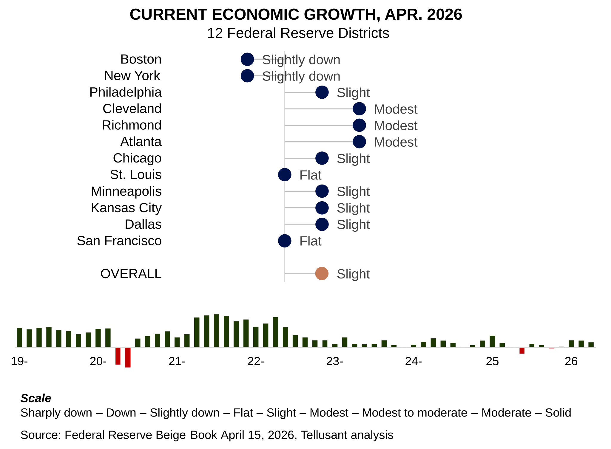
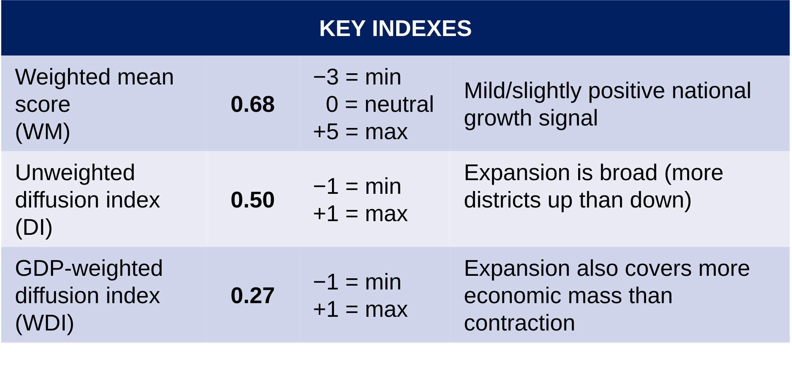

# Nowcast: Sentiment Analysis of Economic Activity Based on the Beige Book of April 15, 2026
The Fed's Beige Book, *[Summary of Commentary on Current Economic Conditions](https://www.federalreserve.gov/monetarypolicy/publications/beige-book-default.htm)*, covers current economic activity for the 12 Federal Reserve Districts. It is published sesqui-monthly (every 1½
months). Tellusant converts it into a quantitative nowcast.  

The Beige Book is useful for, among others, CEOs and management teams who want to quickly assess where the economy is at present.  

We compute a composite score for each of the twelve districts based on a **semantic analysis** of the report, then sum the scores weighted by the GDP of each district.  

We have published these nowcasts since June 2015 on LinkedIn. The new series published here starts in October 2025. The LinkedIn series can still be found there.

>Our analysis is now entirely performed by our Fedora AI agent (v1.1.1). It consists of three parts:
>
>- ChatGPT = runtime environment
>- YAML = serialization algorithm
>- Excel = model + parameters
>
>In the next cycle, ChatGPT will be replaced by a python script and a scheduler such as GitHub Action.

---
Economic activity increased slightly in the April Beige Book, with conditions improving across a broader set of districts even as overall momentum softened from the prior report. 

Eight districts reported expansion, two were little changed, and two noted declines, indicating a more widely distributed but still modest pace of growth. 

Underlying conditions point to continued support from demand and labor markets, though persistent price pressures remain a constraint on overall economic momentum.

> A new feature is a breakdown of contributing factors to the scores. These are also created through semantic analysis of the beige book.

The GDP-weighted growth index edged down to 0.68, while both unweighted and weighted diffusion measures rose, suggesting that activity is becoming more evenly spread across regions. 

Erratic government policies continue to damp growth. The Iran war is reflected in the Beige Book but has a small effect except on inflation.  
 

---
#### [Archive](archive.md)

#### [Retrospective Comparison of Fed Beige Book Nowcast and Actual GDP Growth](retrospective.md)  
