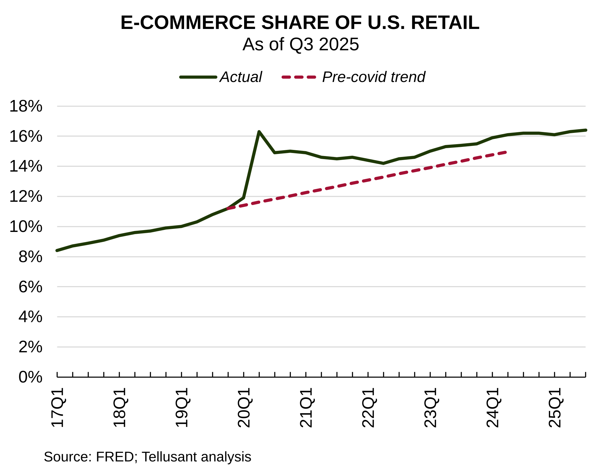

# U.S. E-commerce Trends as of Q3 2025
The e-commerce share of U.S. retail is growing slightly. Growth in revenue is 2-3 p.p. above inflation, far below the heydays of 10-40% annual growth. E-commerce is only growing slightly faster than overall retail sales.

Our quarterly tabulation based on FRED data has been severely delayed due to the government shutdown. But here it finally is.

The graph shows developments in the U.S up to and including 3rd quarter 2025. E-commerce understandably leapt when the pandemic made its mark and, while reverting back, is above the historical performance.

The pre-covid trend is not relevant any more so we have stopped projecting it.

---

---
These analyses were previously published on Tellusant's LinkedIn page and can be found [there](https://www.linkedin.com/company/tellusant/).
