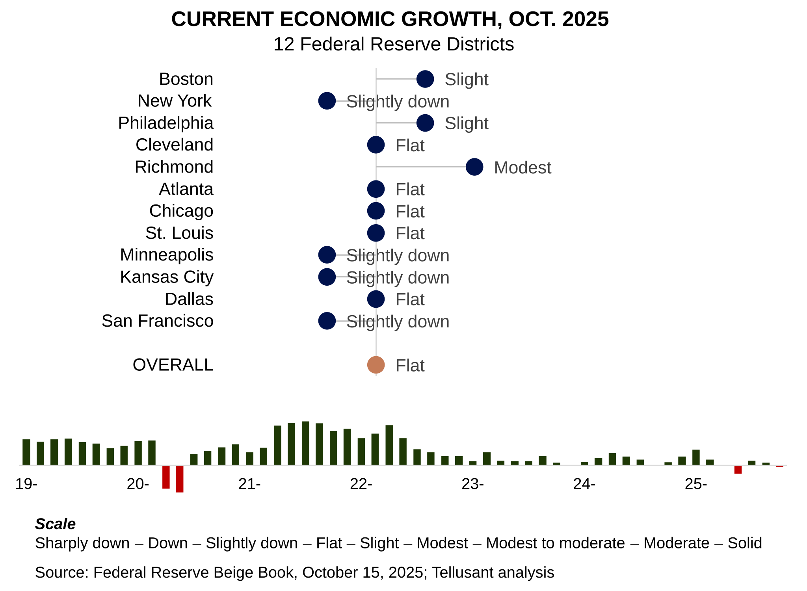

# Beige Book Nowcast Archive
## November 2025

The November 2025 report continues to show significant weakness for the sixth period in a row. It ranks 77th of the 84 periods we have analyzed since beginning of 2016. Discounting covid, June 2025 is the worst).

Only three district show economic expansion:
- Richmond
- Boston
- Chicago
- Cleveland  

Three show contraction:
- Dallas
- Kansas City
- New York
- Philapelphia  

Four are flat.

Dallas is particularly concerning since the district has done well, or very well, for 5 straight years (40 periods).  

Tariffs and erratic government policies are likely causes of the poor performance.  
 

---
  

The October 2025 reportshows significant weakness. It ranks 80th of the 83 periods we have analyzed since beginning of 2016. Discounting two covid periods, it is the second worst in our dataset (June 2025 being the worst).

Only three district show economic expansion:
- Richmond
- Boston
- Philadelphia  

Three show contraction:
- Kansas city
- Minneapolis
- San Francisco  

Six are flat.

Tariffs and erratic government policies are  likely causes of the poor performance.  
 

---

Five years of our Beige Book nowcasts are available on LinkedIn.

Back to [current period](index.md)
