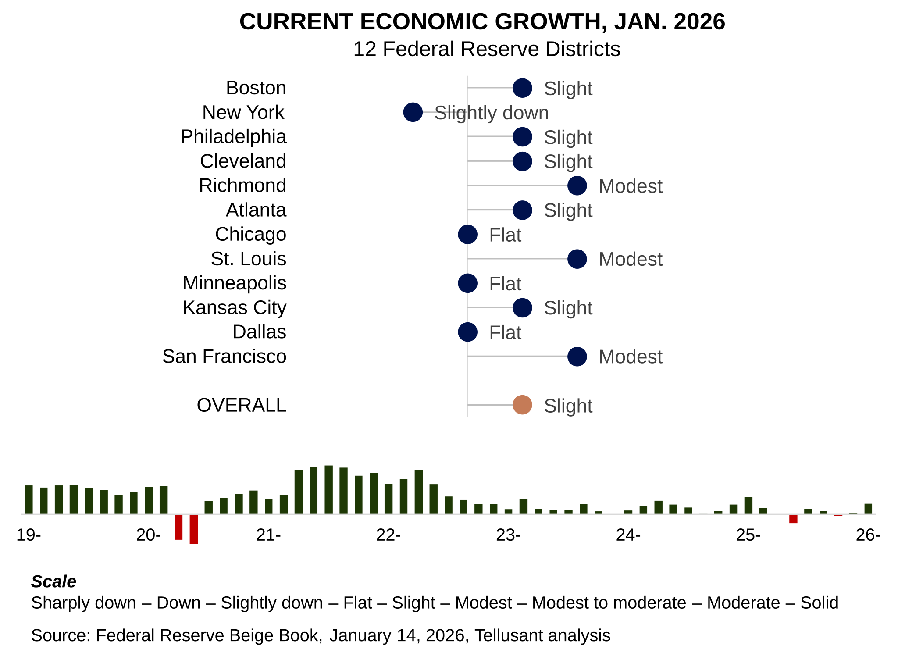

# Nowcast: Semantic Analysis of Economic Activity Based on the Beige Book
The Beige Book, *Summary of Commentary on Current Economic Conditions*, covers current economic activity. It is published sesqui-monthly (every 1 1/2 month) by the Federal Reserve. It gives a qualitative, **text-based**, snapshot of what is currently happening in each of the 12 Federal Reserve Districts. It is thus a nowcast.

The Beige Book is useful for, among others, CEOs and management teams who want to quickly assess where the economy is at present.

We compute a composite score for each of the twelve districts based on a **semantic analysis** of the report, then sum the scores weighted by the GDP of each district.

We have published these nowcasts since June 2015 on LinkedIn. The new series published here starts in October 2025. The LinkedIn series can still be found there.

---
## January 14, 2026

The January 2026 report shows improved economic economic conditions, but still only slight growth.

Three districts show reasonable (modest) growth:
- Richmond
- St. Louis
- San Francisco

Only one shows contraction:
- New York  

The rest are flat or show flat growth.

Erratic government policies continue to damp growth.  
 

#### [Archive](archive.md)

#### [Retrospective Comparison of Fed Beige Book Nowcast and Actual GDP Growth](retrospective.md)  
