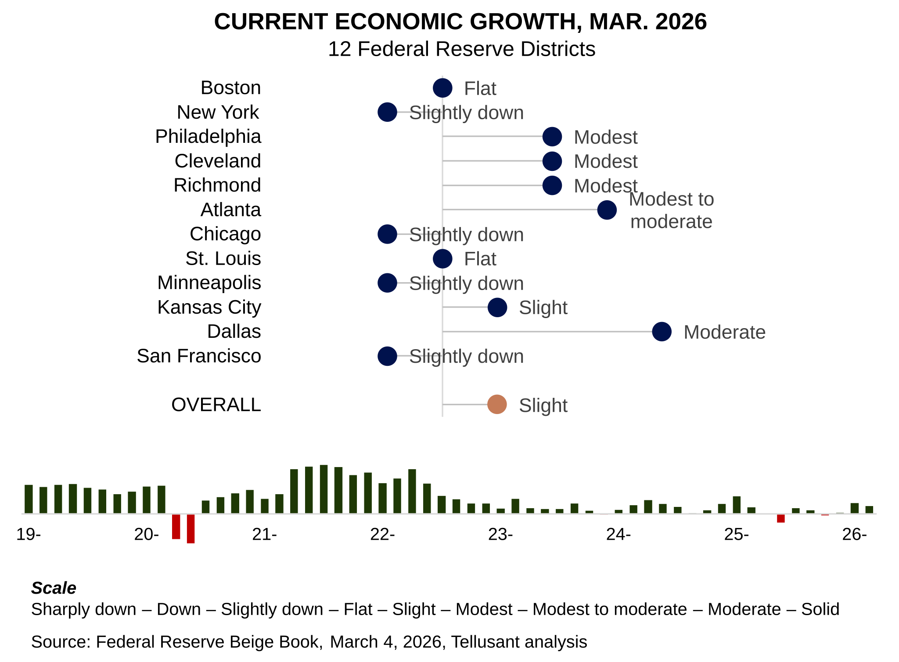

# Nowcast: Sentiment Analysis of Economic Activity Based on the Beige Book of March 4, 2026
The Fed's Beige Book, *[Summary of Commentary on Current Economic Conditions](https://www.federalreserve.gov/monetarypolicy/publications/beige-book-default.htm)*, covers current economic activity for the 12 Federal Reserve Districts. It is published sesqui-monthly (every 1 1/2 month). Tellusant converts it into a quantitative nowcast.  

The Beige Book is useful for, among others, CEOs and management teams who want to quickly assess where the economy is at present.  

We compute a composite score for each of the twelve districts based on a **semantic analysis** of the report, then sum the scores weighted by the GDP of each district.  

We have published these nowcasts since June 2015 on LinkedIn. The new series published here starts in October 2025. The LinkedIn series can still be found there. 

> After more than a decade of publishing this periodical, we decided to test our logic with ChatGPT. Its evaluation:
> "Your methodology is actually quite good. Your method has several strengths:
- Signal is extremely stable
- The Fed has used the same wording patterns for ~30 years.
- High interpretability
- Unlike sentiment models, you can always point to the exact phrase.
- Low model drift
Because vocabulary is controlled, your historical series remains consistent. This is rare in text-based economic indicators.

---

The March 2026 report shows only slight growth. Performance is diverging significantly with some districts doing well, others doing poorly. This divergence is larger than usual.  

Three districts doing relatively well:  
- Dallas  
- Atlanta  
- Cleveland  
- Philadelphia  
- Richmond  

Poor performers are:  
- Chicago  
- Minneapolis  
- New York  
- San Francisco  

The rest are flat or show slight growth.  

The key resulting national indexes are reported below:  

Erratic government policies continue to damp growth. The Iran war is not reflected in the Beige Book yet.  
 

---
#### [Archive](archive.md)

#### [Retrospective Comparison of Fed Beige Book Nowcast and Actual GDP Growth](retrospective.md)  
