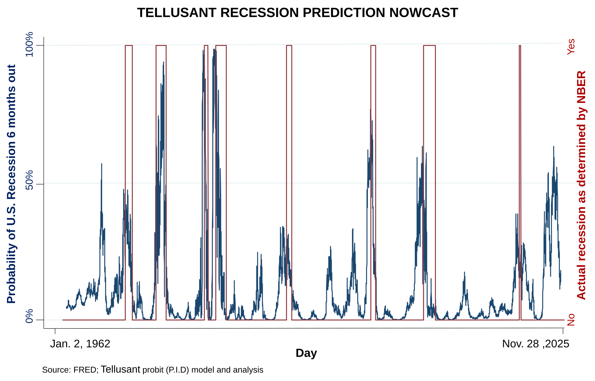

# Probability of U.S. Recession Six Months Out  
Building on Ben Bernanke's recession probability model, we created an improvement using exactly the same the data. Bernanke and the Feduses a P controller, we use a P.I.D. controller. The improvement is large. We have published this nowcast since 2006, until 2025 with Bernanke's specification.

---
## November 28, 2025

  
