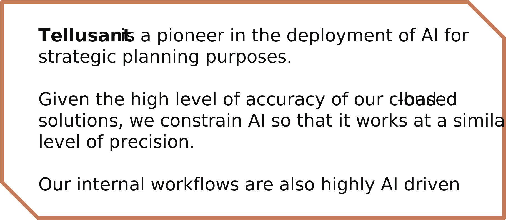
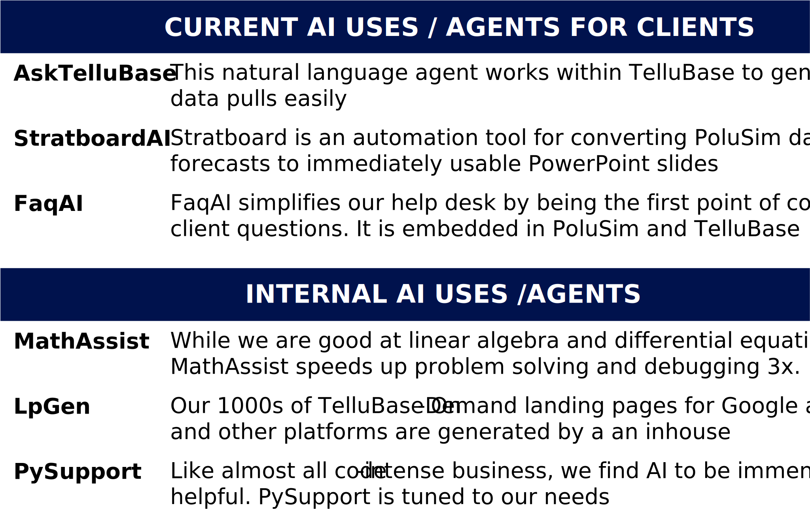

# Tellusant at the Forefront of the AI Revolution

*Tellusant, Inc.*

---
Tellusant has always been at the forefront of the AI revolution. It was the intent behind founding the company and abandoning management consulting (we retain those consulting skills and infuse them in our predictive solutions).  

We are known for the accuracy of our strategic planning solutions. We do not want to jeopardize this by bringing half-baked ideas to market. Our rollout is therefore measured, yet forceful. CEOs should be able to talk with confidence about insights from our solutions in analyst calls (our acid test for success).  

  

Over the past couple of years, what we do is increasingly labeled AI. One can also, like Nvidia, view it as advanced automation. The graph shows examples of our AI agents.  

Internally, we work with AI 25-50% of the day, sometimes 100%. In addition to the agents below, we use general AI like ChatGPT, Claude, and Gemini for a myriad of tasks.  

  

We also have a pipeline of future AI based solutions. Examples are **EMIO** (https://lnkd.in/e7-xtDBZ), our strategy development and strategic planning framework, which will become automatically populated; and our **Innovation Apparatus**, which predicts success or failure for potential consumer goods innovation. 

---
[2025-08-29]
